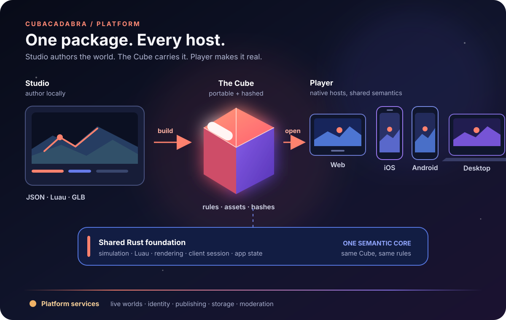
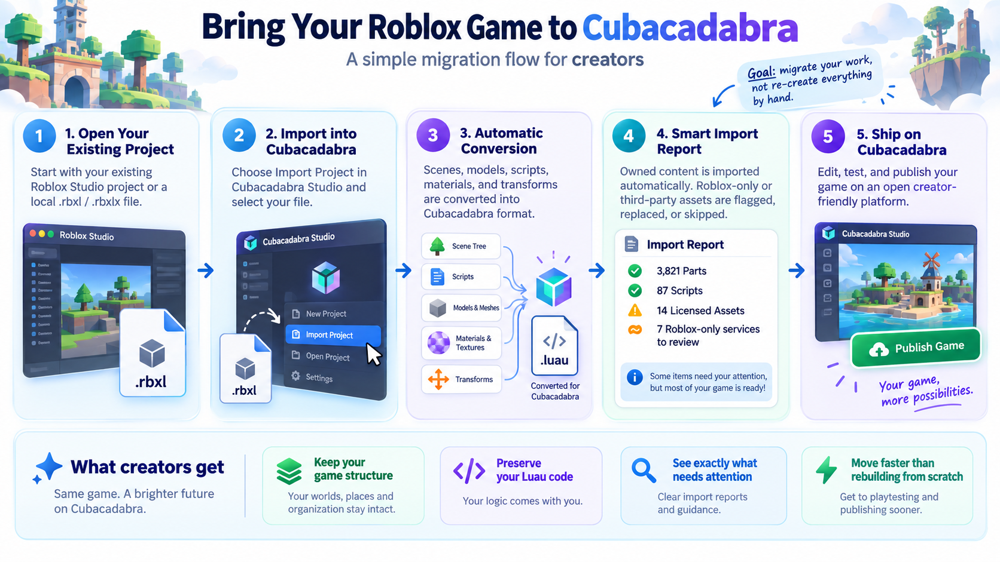
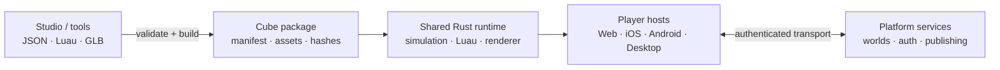
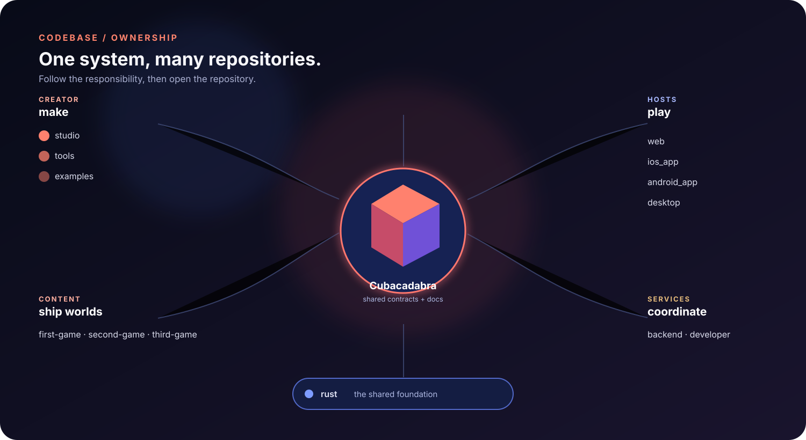

# Cubacadabra

An open-source game platform where creators build once and players play
everywhere.

Cubacadabra Studio authors inspectable source. A native toolchain turns it into
one portable, hashed Cube. Player hosts open that same package through a shared
Rust runtime on Web, iOS, Android, and Desktop.

## Bring your existing game

## Explore Cubacadabra

| Surface | What it is | Start here |
| --- | --- | --- |
| **Studio** | Local creator workspace and preview host | [Studio](products/studio/README.md) |
| **Player** | Web, iOS, Android, and Desktop end-user hosts | [Player](products/player/README.md) |
| **Engine** | Shared Rust simulation, Luau, renderer, and session | [Runtime](systems/runtime/README.md) |
| **Platform** | Live worlds, auth, publishing, storage, and moderation | [Backend systems](systems/backend/README.md) |
| **Creator API** | Package, world, Luau, UI, network, and SDK contracts | [Contracts](contracts/README.md) |

## Architecture in 30 seconds

The package is the portable boundary. Game-specific rules stay with the game;
shared semantics stay in Rust; hosts own presentation, credentials, transport,
and device integration.

## The codebase

Start from the repository you are changing, then follow its canonical links:

- [Repository map](repos/README.md) — one entry for every active sibling repository.
- [Products](products/README.md) — browse by what a person uses.
- [Systems](systems/README.md) — browse by what the platform does.

## Choose your next step

- Continuing current work? Read [Current state](CURRENT_STATE.md).
- New to Cubacadabra? Read [How Cubacadabra works](start/how-cubacadabra-works.md).
- Building a game? Start with [Build your first Cube](start/build-your-first-cube.md).
- Changing a host? Open the matching [repository entry](repos/README.md), then [host conformance](quality/compatibility/host-conformance.md).
- Changing Rust? Read [runtime ownership](systems/runtime/overview.md), then [testing](quality/verification/testing.md).
- Checking a public contract? Use [contracts](contracts/README.md) and [decisions](decisions/README.md).
- Looking for unfinished work? See the [roadmap](reference/roadmap.md).

## Current status

The [current state snapshot](CURRENT_STATE.md) records the active visual
milestone and the latest completed work. The native builder produces package
format 3 and the Maze 101 package is a verified native-build milestone. Rust
provides shared runtime foundations; Studio imports and previews supported GLBs;
and the service has presence plus ordered cooperative retained state.

The major open gaps are trusted game authority, transactional release
activation, end-to-end Morph asset wiring, full host conformance, durable
game-owned data, shared editing, safety/performance budgets, and release
readiness. The [roadmap](reference/roadmap.md) is the current gap list, not a
schedule or release promise.

## Engineering reference

- [Contracts](contracts/README.md) are normative when marked **Status: Current contract**.
- [Decisions](decisions/README.md) explain accepted and proposed constraints.
- [Quality](quality/README.md) collects verification and compatibility evidence.
- [Documentation authority](reference/README.md) explains where cross-repository truth lives.
- [Migration sources](reference/migration-sources.md) is provenance for the completed consolidation, not a reader prerequisite.

## Documentation authority

`contracts/` pages are normative when marked **Status: Current contract**. Each
contract also carries a separate **Maturity** value (`Preview`, `Experimental`,
or `Stable`); maturity does not change whether the text is normative. Decisions
explain why a boundary exists, while quality pages identify the evidence needed
to claim implementation, integration, host verification, or release readiness.

Cross-repository contract changes update this repository in the same piece of
work. Implementation repositories may keep local build, test, and release
instructions, but must link here instead of creating a competing contract.
