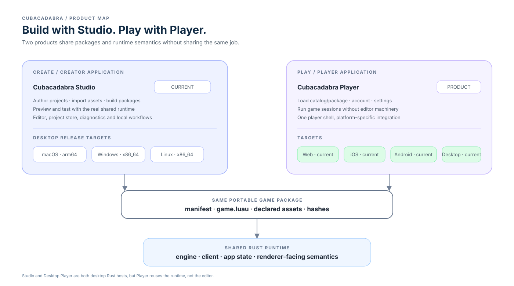
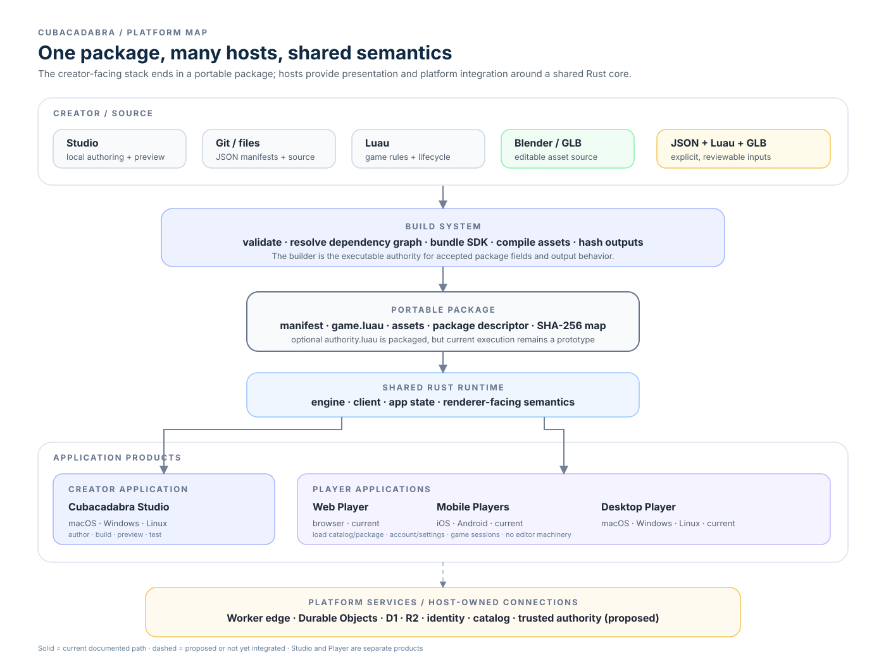
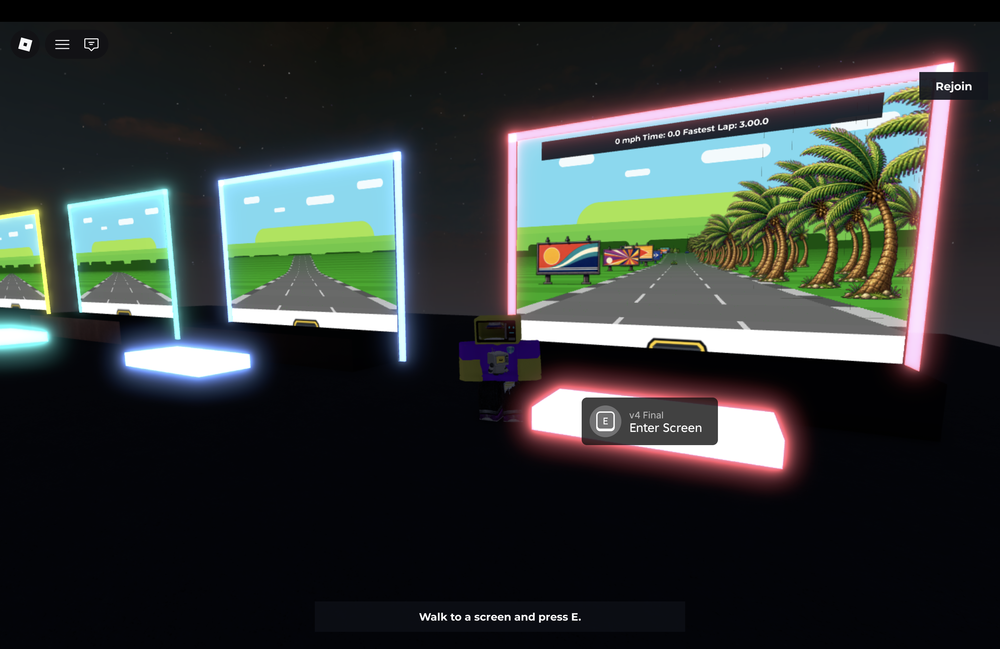
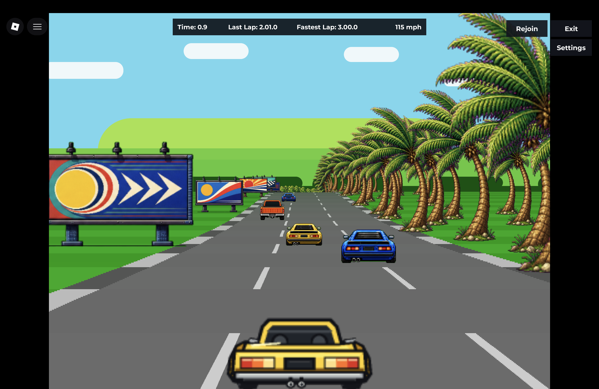

# CUBACADABRA

Open-source game platform, engine, and creator stack.

Cubacadabra combines a custom Rust runtime, Luau game rules, portable hashed
packages, cross-host adapters, Studio authoring, and platform services. This
repository is the canonical home for the hand-written contracts and architecture
that connect those pieces.

**Build with Cubacadabra Studio. Play everywhere with Cubacadabra Player.**

## Platform architecture

## Working product evidence

The images below are real captures from the current evidence set. They show
implemented renderer and example paths; they are not a claim that every capture
comes from one integrated release package.

<table>
  <tr>
    <td></td>
    <td></td>
    <td></td>
  </tr>
  <tr>
    <td align="center">Racer Lab / game evidence</td>
    <td align="center">Example / gameplay evidence</td>
    <td align="center">Renderer / mobile-sized evidence</td>
  </tr>
</table>

## Choose a path

- **Understand Cubacadabra:** [product vision](product/vision.md),
  [principles](product/principles.md), and
  [architecture overview](architecture/overview.md), including the proposed
  [avatar editor boundary](architecture/avatar-editor.md).
- **Understand products and targets:** see the
  [Studio versus Player platform model](product/platforms.md).
- **Build or change a platform feature:** read the relevant page in
  [contracts](contracts/README.md), then the applicable
  [architecture](architecture/README.md) and
  [verification guidance](verification/README.md).
- **Create a game:** start with the
  [creator guide](contracts/creator-guide.md), then use the
  [game package contract](contracts/game-package.md),
  [Luau API](contracts/luau-api.md),
  [world manifest](contracts/world-manifest.md), and SDK contracts in
  [contracts/sdk](contracts/sdk/README.md).
- **Work on Studio:** see [Studio overview](studio/overview.md),
  [creator build toolchain](architecture/toolchain.md),
  [asset workflow](studio/asset-workflow.md), and
  [editing model](studio/editing-model.md).
- **Work on backend services:** see
  [storage](platform/backend-storage.md),
  [Morph catalog and saved appearance](platform/morph-catalog.md),
  [authentication](platform/authentication.md),
  [moderation](platform/moderation.md), and
  [publishing](platform/publishing.md).
- **Understand a design choice:** read [decisions](decisions/README.md) and note each
  record's status.
- **See what remains:** read [roadmap](roadmap.md).
- **Trace migrated material:** consult the
  [source disposition ledger](sources.md). It records provenance and future
  cleanup status; it is not required to understand the platform.

## Documentation authority

`contracts/` pages are normative when marked **Status: Current contract**.
Each contract also carries a separate **Maturity** value (`Preview`,
`Experimental`, or `Stable`) so maturity does not change whether the text is
normative. Other status labels mean:

- **Implemented:** code implements the described behavior; this does not imply
  every product path uses it.
- **Integrated:** the relevant production path invokes the implementation.
- **Host-verified:** evidence exercises the actual host boundary named by the
  page. A Rust unit test or target compile alone is not host verification.
- **Proposed:** a design or acceptance criterion for future work, not a shipped
  behavior or commitment.
- **Historical:** useful context only; it must not override a current contract.
- **Owner confirmation needed:** a product principle or policy proposal that
  has not been approved as a public promise.

Claims about production availability need release evidence in addition to
implementation and integration evidence.

## Maintenance

Any change to a public or cross-repository contract updates its canonical page
here in the same piece of work. Update the owning schema/code/tests as
appropriate, then update this repository and affected host-conformance or
migration guidance. Do not allow an implementation-local `docs/` page or an
old review to become a competing specification. Repository READMEs may retain
local build, test, and release instructions and link here; they should not
restate cross-repository contracts.

The source ledger is a temporary migration record. Once sibling `docs/`
directories have been retired, keep provenance only where it helps explain a
decision; the canonical pages must stand on their own.

Technical diagrams follow the [diagram conventions](diagrams/how.md): keep
living architecture and flows as inline fenced `mermaid` blocks beside their
authoritative prose, reserve SVG for deliberately designed canonical graphics,
and use PNG for screenshots or rendered visual evidence rather than
hand-maintained architecture.
