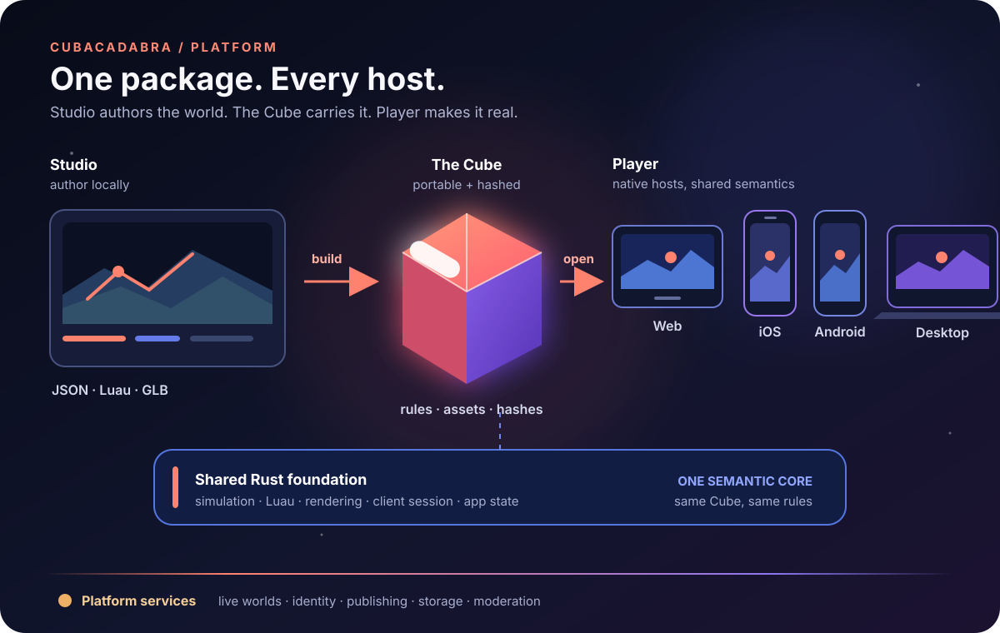
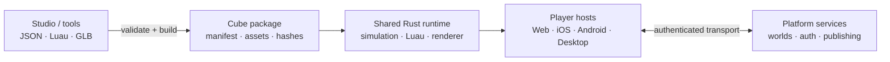
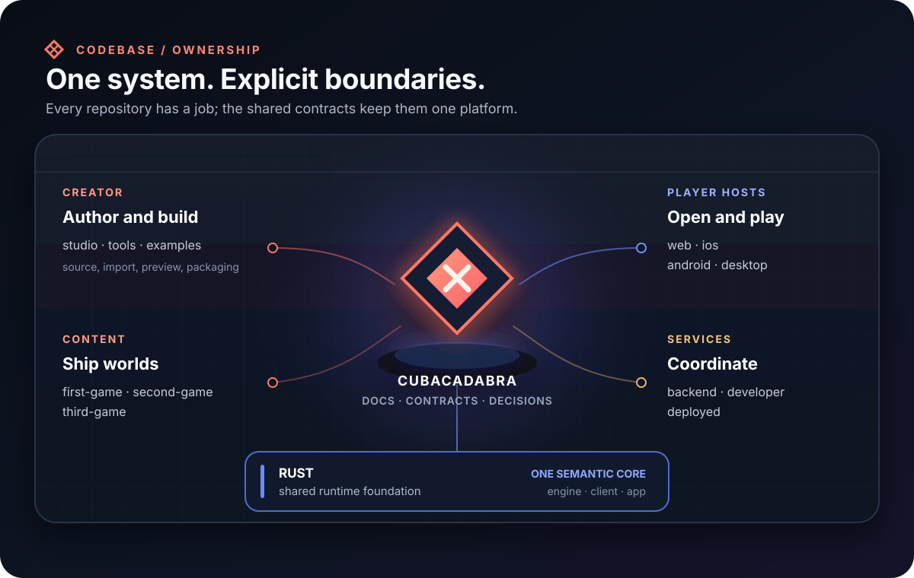

# Cubacadabra

An open-source game platform inspired by Roblox. Author a game in JSON and
Luau, build one portable package, and load it through a shared Rust runtime
on Web, iOS, Android, and Desktop. Platform source is **GPL-3.0-or-later**.

Cubacadabra is **pre-launch**. We are opening the code for review and help from
game developers. Start with [Cuboom](https://github.com/cubacadabra/examples/tree/main/cuboom),
our featured game, then [build it locally](start/build-your-first-cube.md) and
[contribute](CONTRIBUTING.md).

Cubacadabra Studio authors inspectable source. A native toolchain turns it into
one portable, hashed Cube. Player hosts open that same package through a shared
Rust runtime on Web, iOS, Android, and Desktop.

## For Roblox creators

Studio uses familiar workflows: a scene hierarchy, properties, picking,
transforms, grouping, undo, and Play/Stop. Native source is deterministic JSON,
Luau, and ordinary asset formats, so it can be reviewed in Git and edited by
tools as well as Studio. Roblox XML import converts supported scene content;
scripts and unsupported resources need adaptation. Read the
[interchange limits](products/studio/roblox-project-interchange.md) before
bringing an existing project.

## Explore Cubacadabra

| Surface | What it is | Start here |
| --- | --- | --- |
| **Studio** | Local creator workspace and preview host | [Studio](products/studio/README.md) |
| **Player** | Web, iOS, Android, and Desktop end-user hosts | [Player](products/player/README.md) |
| **Engine** | Shared Rust simulation, Luau, renderer, and session | [Runtime](systems/runtime/README.md) |
| **Platform** | Live worlds, auth, publishing, storage, and moderation | [Backend systems](systems/backend/README.md) |
| **Creator API** | Package, world, Luau, UI, network, and SDK contracts | [Contracts](contracts/README.md) |

## Architecture in 30 seconds

```mermaid
flowchart LR
    Source["Studio / tools<br/>JSON · Luau · GLB"] -->|validate + build| Cube["Cube package<br/>manifest · assets · hashes"]
    Cube --> Rust["Shared Rust runtime<br/>simulation · Luau · renderer"]
    Rust --> Hosts["Player hosts<br/>Web · iOS · Android · Desktop"]
    Hosts <-->|authenticated transport| Services["Platform services<br/>worlds · auth · publishing"]
```

The package is the portable boundary. Game-specific rules stay with the game;
shared semantics stay in Rust; hosts own presentation, credentials, transport,
and device integration.

## The codebase

Start from the repository you are changing, then follow its canonical links:

- [Repository map](repos/README.md) — one entry for every active sibling repository.
- [Products](products/README.md) — browse by what a person uses.
- [Systems](systems/README.md) — browse by what the platform does.

## Choose your next step

- Continuing current work? Read [Current state](CURRENT_STATE.md).
- New to Cubacadabra? Read [How Cubacadabra works](start/how-cubacadabra-works.md).
- Building a game? Start with [Build your first Cube](start/build-your-first-cube.md).
- Want to help with a game? Start with [Cuboom](https://github.com/cubacadabra/examples/tree/main/cuboom).
- Changing a host? Open the matching [repository entry](repos/README.md), then [host conformance](quality/compatibility/host-conformance.md).
- Changing Rust? Read [runtime ownership](systems/runtime/overview.md), then [testing](quality/verification/testing.md).
- Checking a public contract? Use [contracts](contracts/README.md) and [decisions](decisions/README.md).
- Looking for unfinished work? See the [roadmap](reference/roadmap.md).

## Current status

The [current state snapshot](CURRENT_STATE.md) identifies working foundations
and useful contribution areas. The native builder produces package format 3;
Studio and the CLI share the same source and build path. The service has
presence and ordered cooperative retained state. Cuboom exercises scene
authoring, physics, effects, and cooperative play; smaller examples isolate
other supported APIs.

The major open gaps are trusted game authority, transactional release
activation, end-to-end Morph asset wiring, full host conformance, durable
game-owned data, shared editing, safety/performance budgets, and release
readiness. The [roadmap](reference/roadmap.md) is the current gap list, not a
schedule or release promise.

## Engineering reference

- [Contracts](contracts/README.md) are normative when marked **Status: Current contract**.
- [Decisions](decisions/README.md) explain accepted and proposed constraints.
- [Quality](quality/README.md) collects verification and compatibility evidence.
- [Documentation authority](reference/README.md) explains where cross-repository truth lives.
- [Migration sources](reference/migration-sources.md) is provenance for the completed consolidation, not a reader prerequisite.

## Documentation authority

`contracts/` pages are normative when marked **Status: Current contract**. Each
contract also carries a separate **Maturity** value (`Preview`, `Experimental`,
or `Stable`); maturity does not change whether the text is normative. Decisions
explain why a boundary exists, while quality pages identify the evidence needed
to claim implementation, integration, host verification, or release readiness.

Cross-repository contract changes update this repository in the same piece of
work. Implementation repositories may keep local build, test, and release
instructions, but must link here instead of creating a competing contract.
