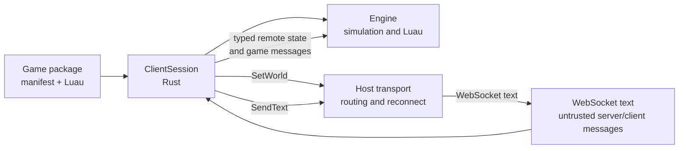
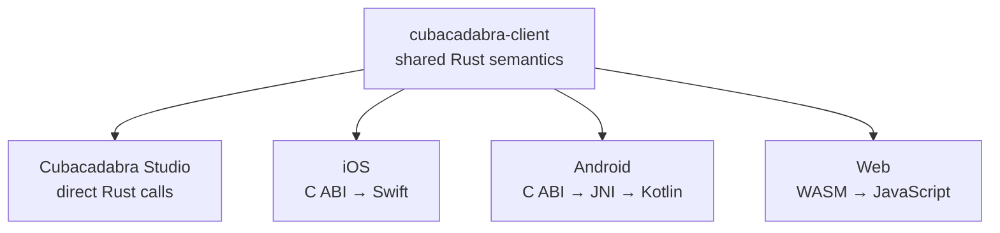

# Shared client runtime

**Contract status:** current shared client/session contract. Hosts must follow this boundary.

`cubacadabra-client` is the common engine-facing client used by all four
interactive hosts. It exists so Swift, Kotlin, JavaScript, and Studio do not
independently implement the same multiplayer state machine.

**Shared session and transport flow**

**Bindings adapt one Rust implementation**

The bindings expose the same client/session semantics; they are not separate
implementations of Cubacadabra gameplay or protocol decisions.

## Rust owns

- creating and validating a session from `manifest.json` and `game.luau`;
- typed decoding of engine-relevant WebSocket messages;
- session identity, remote-player state, movement correction, and generation;
- versioned remote-roster updates into the engine;
- launch destination and per-session backend-world routing;
- forwarding game state/messages into Luau;
- converting the Luau outbox into backend protocol messages; and
- filtering ignored player or account IDs from the engine roster.

## Hosts own

- package discovery, downloads, caching, and image/audio decoding;
- opening, reconnecting, authenticating, and closing the WebSocket;
- sending local movement with platform-appropriate throttling;
- account, username, appearance, moderation, catalog, and OS UI flows;
- windows/surfaces, lifecycle, input devices, audio playback, and renderer
  presentation.

The host passes every received text message to `ClientSession::receive_text`
even if it also consumes that message for UI. Before and after each engine
step, it polls `ClientSession::poll_actions` and performs each action:

- `SetWorld(id)` connects the host transport to that backend world.
- `SendText(json)` sends the exact JSON text on the active transport, queueing
  it according to the host's normal reconnect policy.

Transport open/close edges must call `transport_connected` and
`transport_disconnected`. A transient close keeps the desired route because
socket backoff belongs to the host; call `request_transport` when resuming
after an intentional stop. Hosts may retain presentation-only player maps for
menus or moderation, but they must not separately reconcile the engine roster
or translate the Luau network outbox.

## Binding rules

Studio depends on `cubacadabra-client` directly and uses Rust methods and
enums. It should not route Rust-to-Rust calls through JSON or the C ABI.

iOS and Android create an opaque `CubacadabraClient`. `client_engine` returns a
borrowed engine pointer for existing input, snapshot, and renderer APIs. The
pointer becomes invalid when the client is destroyed.

The browser instantiates `WebClient` and `WebRenderer` from one generated WASM
module so renderer and engine handles refer to the same WebAssembly memory.
