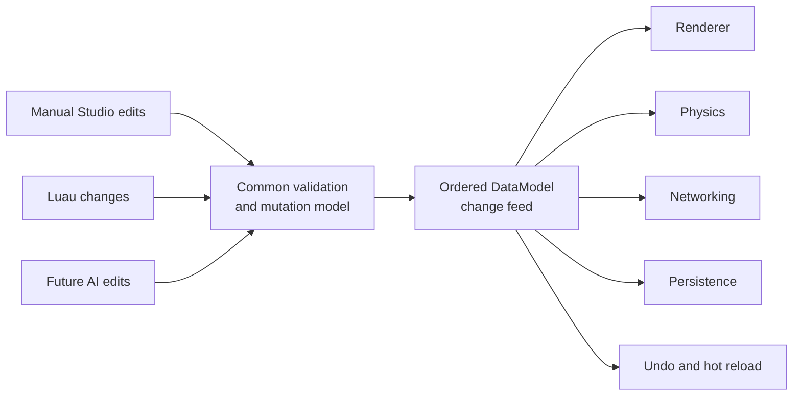

# Generic data model and mutation feed

**Status:** Implemented foundation; downstream renderer/physics/Studio
integrations remain incomplete.

The Rust `DataModel` owns a stable `EntityId` graph rooted at `game`. An entity
has a class, name, parent, and JSON-compatible property bag. Game-specific
concepts remain in Luau; the model represents generic engine objects and
properties.

**Proposed shared mutation integration**

This is the proposed convergence path. The `DataModel` and ordered feed exist;
the creator-facing Luau surface and the downstream consumer bridges shown here
remain incomplete.

## Mutation contract

The mutation methods are `create_entity`, `set_name`, `set_parent`,
`set_property`, `remove_property`, and `destroy`. Every successful mutation
emits a `DataModelChange` with a monotonic sequence, `MutationSource`, and
typed `DataModelEvent`.

Setting an equal property, retaining the current name/parent, or removing a
missing property is a no-op and emits no event. Destroy events include
pre-despawn snapshots so consumers can inspect removed objects.

Consumers subscribe at the current position or from the beginning, then drain
the ordered feed with `changes_since`. History is bounded. A stalled consumer
gets an explicit cursor-too-old error instead of silently missing mutations.
Snapshot restore clears live change history; consumers must create a new
cursor after restore.

## Integration boundary

`Engine::data_model()` and `Engine::data_model_mut()` expose the model to
trusted engine integrations. The current implementation is not yet a
creator-facing Luau `Instance` API and is not automatically bridged to the
renderer, physics, networking, or persistence. Future consumers should use
this mutation path instead of parallel setters or per-frame full-model scans.

## Shared property descriptions

Define engine property metadata once and reuse it for simulation validation,
scripting, and tools. The current `InteractionZone` metadata slice provides
stable IDs, labels, value types, defaults, validation ranges, and runtime
flags to manifest validation and `api.interactions:get_schema`. Do not build a
general reflection system until a second real duplicated contract needs it.
