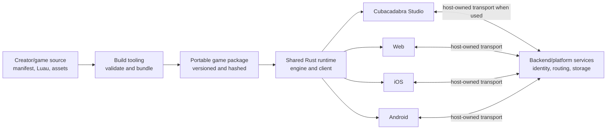
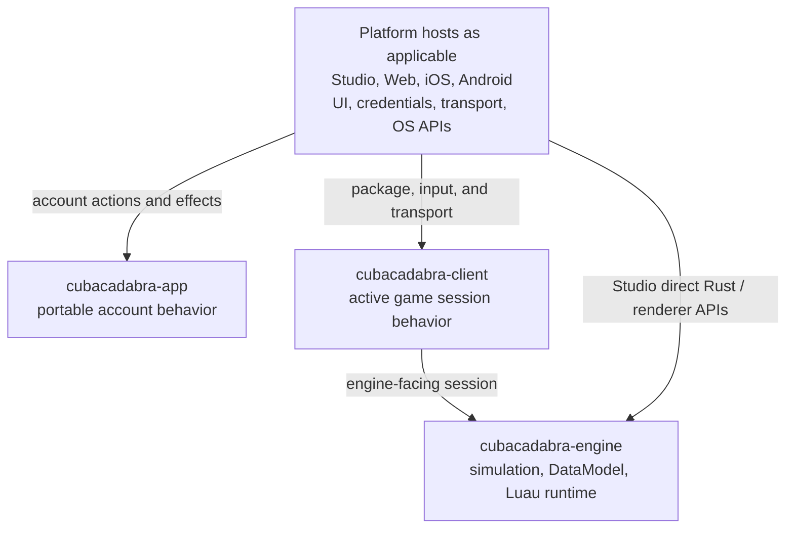

# Architecture overview

Cubacadabra is one cross-platform game platform split across repositories.
The Rust engine owns portable simulation and rendering-facing data; the game
package owns game-specific rules in Luau; hosts own operating-system
presentation, credentials, transports, and device integration; the backend
owns identity, routing, storage, and server-validated service behavior.

**Cubacadabra at a glance**

## Repository responsibilities

| Area | Owns | Does not own |
| --- | --- | --- |
| `rust` | Shared engine, client and application-runtime behavior, typed contracts, portable simulation | Product rules for an individual game; credentials or OS UI |
| `tools` | Project creation, SDK bundling, validation and package construction | Runtime authority or host presentation |
| `studio` | Local authoring, preview, asset workflow and editor interactions | A separate interpretation of package validity |
| `backend` | Authentication, world routing, service validation, retained data and package delivery | Game-specific rules such as a particular score or gate |
| `web`, `ios_app`, `android_app` | Host UI, device APIs, credentials, transport and platform decoding | Independent copies of shared gameplay or account decisions where Rust owns them |
| `docs` | Canonical hand-written platform docs, contracts, decisions, and verification criteria | Generated API output or executable fixtures |

**Runtime ownership layers**

`cubacadabra-app` and `cubacadabra-client` are sibling semantic layers. Host
bindings adapt them to each platform; they are not separate implementations of
Cubacadabra rules.

## Important boundaries

- Game-specific nouns and rules stay in Luau. Rust exposes generic concepts
  shared across games.
- The backend may order and retain client-proposed values without validating
  whether the game rule was legitimate. See [authority](authority.md).
- Hosts adapt platform facilities to shared contracts. They must not create a
  second state machine for the same protocol. See
  [client runtime](client-runtime.md) and [application runtime](app-runtime.md).
- Authored source and immutable runtime assets are distinct. See
  [assets and prefabs](assets-and-prefabs.md) and the normative
  [MorphPack v5 contract](../contracts/morph-pack-v5.md).
- A tested prototype is not production integration. Status definitions are in
  the [documentation README](../README.md#documentation-authority).

## Current implementation boundaries

The shared Rust `DataModel` is a generic entity graph and ordered mutation
feed. It is a foundation, not yet a complete creator-facing `Instance` API or
renderer/physics/network/persistence bridge. The authority boundary and
`authority.luau` package entry are prototypes, not a live trusted two-player
execution path. Studio's local Morph import and preview work, while automatic
manifest wiring and reproducible cross-client use remain unfinished.

These boundaries are deliberately repeated on the specific pages where an
implementer needs them. The [roadmap](../roadmap.md) tracks the cross-platform
gaps.
