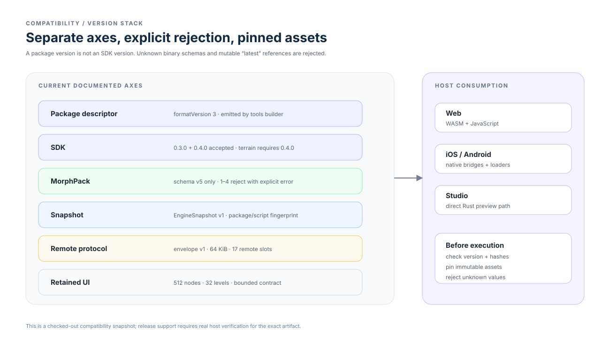

# Compatibility

Package format, SDK, MorphPack, snapshot, protocol, and UI values are separate
compatibility axes. Hosts must validate the exact artifact and reject unknown
or mutable interpretations.

- [Version matrix](versions.md) — package, SDK, MorphPack, snapshot, and
  protocol values.
- [Morph migrations](morph-migrations.md) — legacy ID mapping and failure
  behavior, with inventory age called out.
- [Host conformance](host-conformance.md) — behavioral parity across actual
  runtime and host paths.
