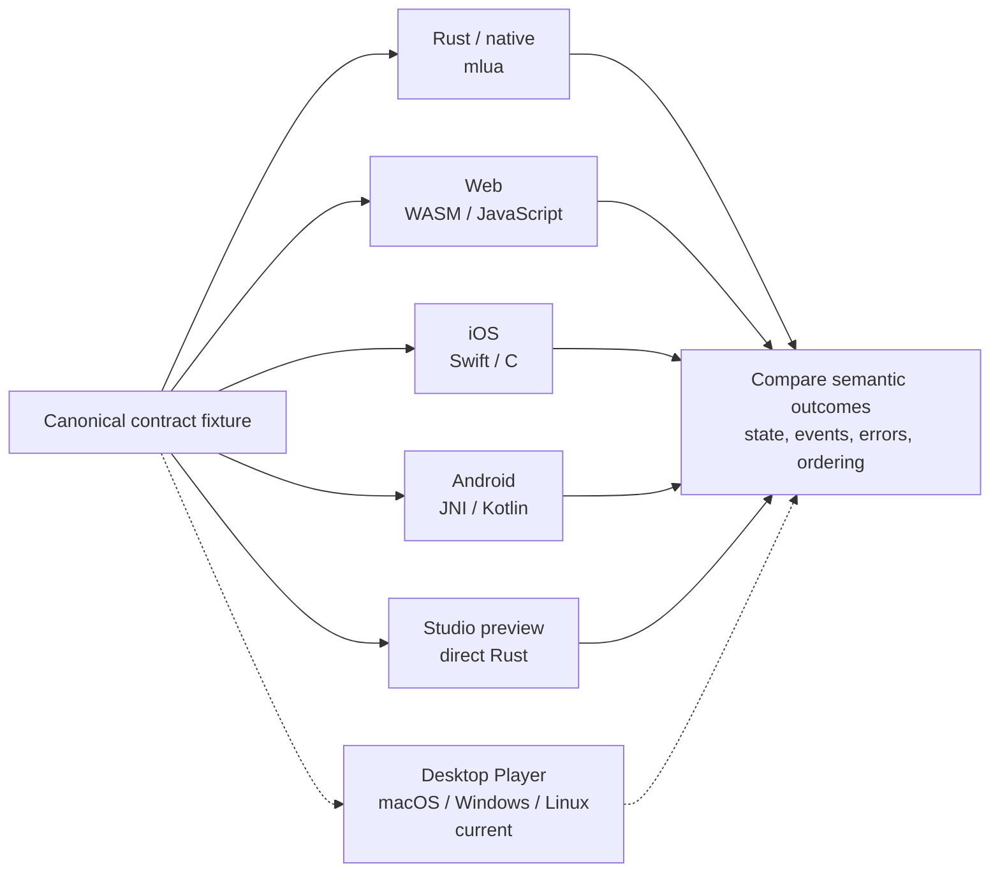

# Host conformance

Portable behavior means equivalent outcomes at each real host boundary, not
merely shared Rust code or a successful target compile. Compare native `mlua`
and browser `luaur-rt` behavior and exercise the actual Player hosts—web, iOS,
and Android—plus the Studio preview/loading path where those hosts consume the
contract. Native Desktop Player hosts for macOS, Windows, and Linux are now
implemented and need their own evidence; implementation and target compilation
alone are not current conformance claims.

**One fixture, comparable semantic outcomes**

A target compiling successfully does not traverse these production adapter,
loader, lifecycle, and cache boundaries and therefore is not host-conformance
evidence.

## Compare semantic behavior

For each supported contract, fixtures should compare:

- accepted/rejected result and stable error classification;
- structured error fields, IDs, and retryability, not just localized text;
- lifecycle and callback order;
- module cache behavior and require resolution;
- task scheduling, FIFO order, tick boundaries, and yield behavior;
- JSON conversion and numeric edge cases;
- API state transitions and emitted network/UI/effect/audio commands;
- package, manifest, script, and asset loading/cache behavior.

When a host transforms a shared error for display, it must retain the semantic
reason and associated fields. Shared validator tests do not verify a host
loader or cache path; test both layers.

## Required host evidence

- Rust unit tests for generic runtime semantics.
- Browser tests using generated WASM and JavaScript host adapters.
- iOS tests through the production Swift/C bridge and app lifecycle.
- Android tests through JNI/Kotlin production paths; target compilation is
  not an APK/device test.
- Studio direct Rust API tests for editor and preview boundaries.
- Package tests that load the built output, not only source validators.

Desktop Player conformance must exercise the actual macOS, Windows, and Linux
player shells in this fixture matrix. Studio evidence must remain labeled as
creator-host preview evidence, not end-user Player evidence.

Current gaps and acceptance probes are in
[verification/testing.md](../verification/testing.md) and
[verification/acceptance-criteria.md](../verification/acceptance-criteria.md).
