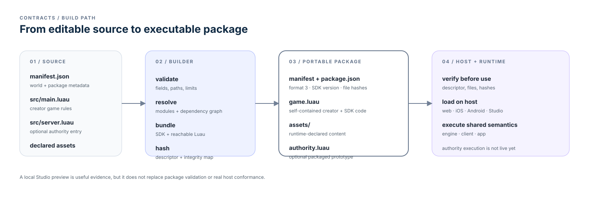
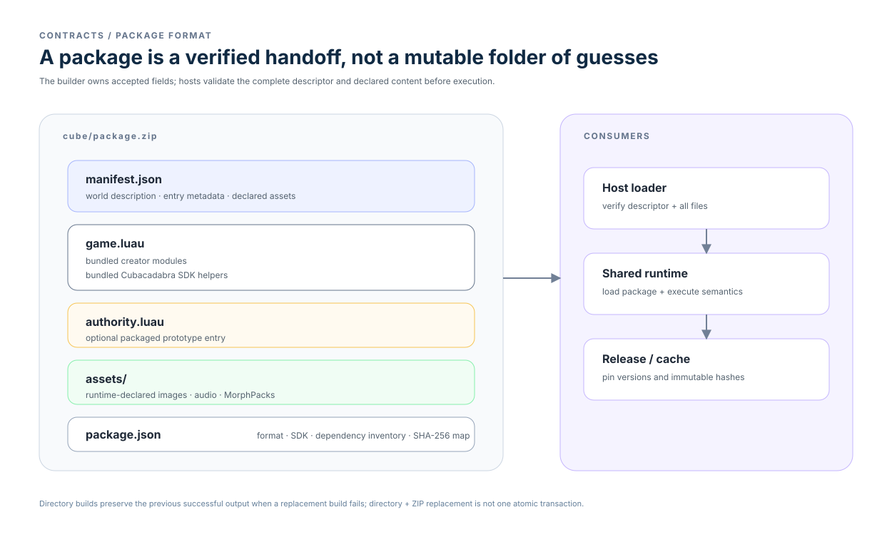

# Contracts

The contract surface describes the portable handoff from creator source through
validation and packaging to host loading. Current contracts are normative when
marked **Status: Current contract**; their separate maturity label describes how
settled the implementation is.

Normative and versioned technical behavior:

- [Game package](game-package.md), [creator guide](creator-guide.md),
  [lifecycle](lifecycle.md), and [world manifest](world-manifest.md).
- [Luau API index](luau-api.md), [UI](ui.md), [network](network.md),
  [audio](audio.md), [effects](effects.md), [tasks](tasks.md), and
  [snapshots](snapshots.md).
- [MorphPack v5](morph-pack-v5.md).
- [SDK modules](sdk/README.md).
