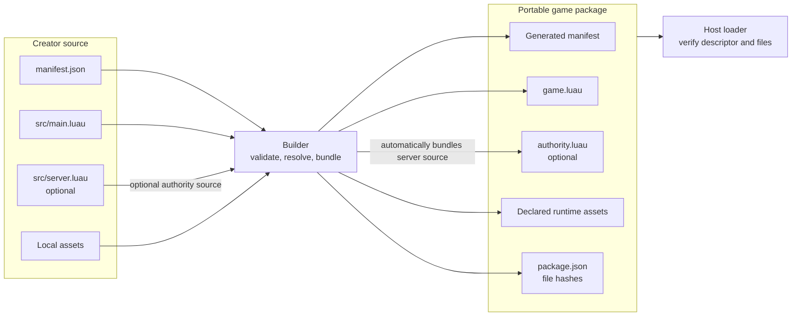
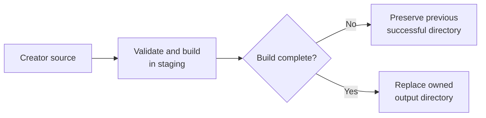

# Game package contract

**Status:** Current contract

**Maturity:** Preview

The builder validates creator source and produces the
portable package consumed by hosts. Package metadata includes a manifest,
the bundled game entry, an SDK/API version, and declared runtime assets. A
package descriptor and file hashes let hosts verify the downloaded files.

The builder is the current executable authority for accepted manifest fields,
SDK versions, path validation, module resolution, and output behavior. Keep
this page focused on cross-repository semantics; exact field details are
specified by the builder's schema/tests and must be migrated here before those
sources are retired. Never infer a format field from a sample that the
builder does not accept.

Bounded procedural maze declarations are expanded during the native build into
the generated manifest's ordinary terrain, interactions, checkpoints, and
effects. The resulting package is self-contained; hosts do not need the maze
authoring shorthand or a separate maze generator at runtime.

**Creator source to host loading**

The optional `authority.luau` output is a packaged prototype artifact. Its
presence does not imply that an interactive host or backend executes it.

## Version distinction

The current tools builder supports SDK versions `0.3.0` and `0.4.0`;
`world.terrain` requires `0.4.0`. The default project creator emits SDK
`0.3.0` and package `formatVersion: 3`. Package format version and SDK version
are separate compatibility axes. See
[the version matrix](../quality/compatibility/versions.md).

## Authority entry

When `src/server.luau` exists, the builder automatically bundles it as
`authority.luau` and records the authority entry in generated manifest and
package descriptor metadata and hashes. A declared authority entry without
the source file is an error. This packaging behavior does not mean any
interactive host or backend currently executes the entry; see
[authority](../systems/authority/overview.md).

## Asset declarations

Assets needed at runtime must be explicitly declared in package metadata and
included in the package's integrity data. A local Studio catalog entry alone
does not make an asset available to every host. Hosts validate the descriptor
and declared content before use; failure must be explicit and must not fall
back to a mutable “latest” asset that can mix package revisions.

The builder accepts image assets under `assets.images`, WAV audio under
`assets.audio`, and embedded GLB model files under `assets.models`. Desktop,
Studio, iOS, Android, and browser hosts load declared GLBs before the first
frame and register them with the shared indexed, instanced world-mesh
renderer. The current runtime accepts embedded binary buffers and static
position/normal/UV geometry; external glTF references, textures, animation,
and mesh collision are not yet supported. The cross-repository
`tools/scripts/check_world_model_hosts.py` check guards this host-registration
contract.

Opaque world geometry, terrain, imported world meshes, and Morph characters
share the engine's directional shadow path. The current renderer builds a
player-centered orthographic shadow map and applies a small percentage-closer
filter to receivers; shadow coverage and quality are runtime presentation
settings, not package-authored state. Hosts must keep this path available when
they register world meshes, but packages do not need to declare shadow assets.

## Build failure guarantees

The builder rejects source/output overlap and refuses to replace an output it
does not own. Directory builds stage their contents and preserve the previous
successful directory if the new build fails. Directory plus ZIP output is
not currently a single atomic transaction: the two replacements can succeed
or fail independently. See the proposed release activation criteria in
[verification/acceptance-criteria.md](../quality/verification/acceptance-criteria.md).

Raw source package builds use the shared Rust `cubacadabra-builder` crate. The
native `cubacadabra` CLI in `tools` is the terminal frontend over that crate,
while Studio links it in-process. Python remains only for tools commands that
have not yet moved into Rust and the compatibility harness; it is not required
by Studio. See [Studio workflow](../products/studio/overview.md).

**Safe directory build replacement**

This guarantee applies to directory replacement. Directory plus ZIP output is
not currently one atomic transaction.
