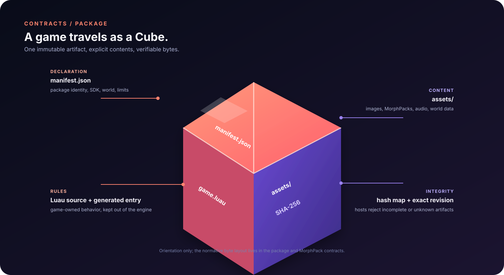
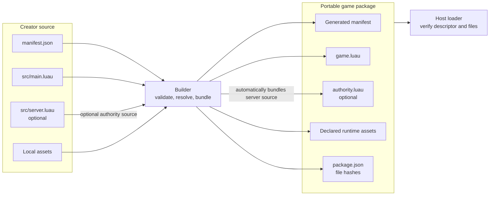
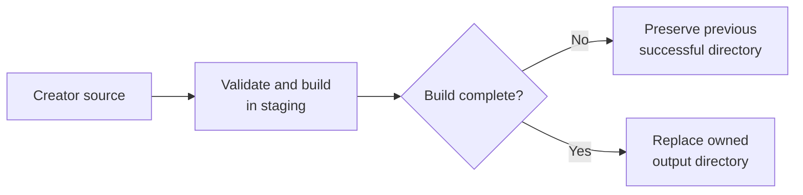

# Game package contract

**Status:** Current contract

**Maturity:** Preview

The builder validates creator source and produces the
portable package consumed by hosts. Package metadata includes a manifest,
the bundled game entry, an SDK/API version, and declared runtime assets. A
package descriptor and file hashes let hosts verify the downloaded files.

The builder is the current executable authority for accepted manifest fields,
SDK versions, path validation, module resolution, and output behavior. Keep
this page focused on cross-repository semantics; exact field details are
specified by the builder's schema/tests and must be migrated here before those
sources are retired. Never infer a format field from a sample that the
builder does not accept.

The backend upload boundary currently accepts ZIP archives up to 25 MiB, with
at most 256 extracted files, 64 MiB per extracted file, and 96 MiB total
uncompressed content. `manifest.json` may be up to 64 MiB within those bounds.
These limits bound service-side extraction and are independent of host download
or runtime memory budgets.

Bounded procedural maze declarations are expanded during the native build into
the generated manifest's ordinary terrain, interactions, checkpoints, and
effects. The resulting package is self-contained; hosts do not need the maze
authoring shorthand or a separate maze generator at runtime.

**Creator source to host loading**

The optional `authority.luau` output is a packaged prototype artifact. Its
presence does not imply that an interactive host or backend executes it.

## Version distinction

The current runtime and native tools builder support SDK versions `0.3.0`,
`0.4.0`, `0.5.0`, and `0.6.0`; `world.terrain` requires `0.4.0`, `0.5.0`, or
`0.6.0`.
Static triangle collision, `world.camera`, and
`world.physics.horizontalBounds` require an explicit `sdkVersion` of `0.5.0` or
`0.6.0`
so older engines cannot silently ignore their semantics. The default project
creator emits SDK `0.3.0` and package `formatVersion: 3`. Package format
version and SDK version are separate compatibility axes. Static triangle
collision also has its own required `collision.formatVersion`; format 1 is
accepted when the package SDK is `0.5.0` or `0.6.0`. Non-uniform mesh scaling
uses `scale3` and requires SDK `0.6.0`. The retired Python builder
intentionally rejects current native capabilities; use the native builder for
current packages.
See
[the version matrix](../quality/compatibility/versions.md).

## Authority entry

When `src/server.luau` exists, the builder automatically bundles it as
`authority.luau` and records the authority entry in generated manifest and
package descriptor metadata and hashes. A declared authority entry without
the source file is an error. This packaging behavior does not mean any
interactive host or backend currently executes the entry; see
[authority](../systems/authority/overview.md).

## Asset declarations

Assets needed at runtime must be explicitly declared in package metadata and
included in the package's integrity data. A local Studio catalog entry alone
does not make an asset available to every host. Hosts validate the descriptor
and declared content before use; failure must be explicit and must not fall
back to a mutable “latest” asset that can mix package revisions.

The builder accepts image assets under `assets.images`, WAV audio under
`assets.audio`, and embedded GLB model files under `assets.models`. Desktop,
Studio, iOS, Android, and browser hosts load declared GLBs before the first
frame and register them with the shared indexed, instanced world-mesh
renderer. The current runtime accepts embedded binary buffers and static
position/normal/UV geometry plus optional normalized `COLOR_0` vertex colors.
A mesh decoration can reference a named world
material, allowing its UVs to sample a package image atlas; external glTF
references, embedded glTF image extraction, animation, and mesh-collision
inference are not supported. A world can instead carry bounded format-1 static
collision triangles as ordinary manifest data. Those triangles are already in
world coordinates and are consumed directly by the shared runtime, independent
of whether a host initializes a renderer or registers the corresponding GLB.
See the [world manifest contract](world-manifest.md#static-triangle-collision).
The cross-repository
`tools/scripts/check_world_model_hosts.py` check guards this host-registration
contract.

Model asset declarations may also include authoring-only `bounds: [x, y, z]`
metadata. These are local GLB dimensions produced by the source importer and
used by Studio for selection and resize handles; runtime mesh decorations do
not consume this field. Importers should derive it from emitted GLB vertices or
the generated `*.bounds.json` sidecar rather than hand-entering dimensions.

Opaque world geometry, terrain, imported world meshes, and Morph characters
share the engine's directional shadow path. The current renderer builds a
player-centered orthographic shadow map and applies a small percentage-closer
filter to receivers; shadow coverage and quality are runtime presentation
settings, not package-authored state. Hosts must keep this path available when
they register world meshes, but packages do not need to declare shadow assets.
The supported world-mesh subset currently covers embedded static GLB geometry
with indexed positions, normals, UVs, optional vertex colors, package-atlas
albedo, basic color/tint, and instancing; node animation, mesh collision,
external glTF resources, and embedded glTF material extraction remain separate
capabilities. “Mesh collision” here means deriving physics from GLB content;
explicitly authored portable triangle collision is a separate manifest
capability.

## Build failure guarantees

The builder rejects source/output overlap and refuses to replace an output it
does not own. Directory builds stage their contents and preserve the previous
successful directory if the new build fails. Directory plus ZIP output is
not currently a single atomic transaction: the two replacements can succeed
or fail independently. See the proposed release activation criteria in
[verification/acceptance-criteria.md](../quality/verification/acceptance-criteria.md).

Raw source package builds use the shared Rust `cubacadabra-builder` crate. The
native `cubacadabra` CLI in `tools` is the terminal frontend over that crate,
while Studio links it in-process. Python is not required for package builds or
Studio; it remains only for maintainer workflows that have not yet moved into
Rust. See [Studio workflow](../products/studio/overview.md).

**Safe directory build replacement**

This guarantee applies to directory replacement. Directory plus ZIP output is
not currently one atomic transaction.
