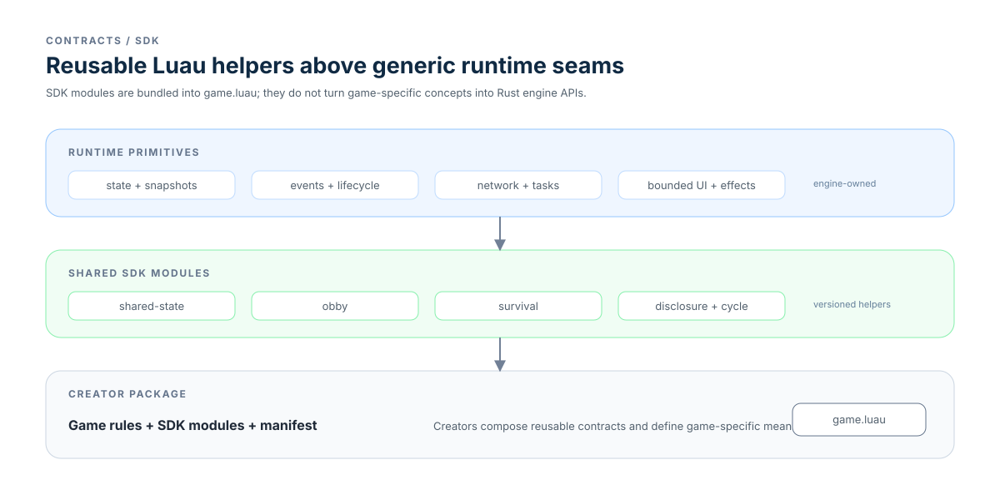

# SDK contracts

The SDK is a versioned Luau helper layer over generic runtime primitives. It is
bundled into the game package so reusable lifecycle and state patterns travel
with the creator's game.

- [Shared state v1](shared-state.md) — cooperative retained state, retries,
  and distinct operation IDs.
- [Obby v1](obby.md) — lifecycle status and checkpoints.
- [Survival v1](survival.md) — health/death/respawn lifecycle state.
- [Disclosure v1](disclosure.md) — open/close behavior for authored UI nodes.
- [Cycle v1](cycle.md) — local deterministic two-phase clock.
