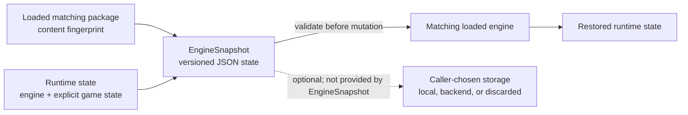
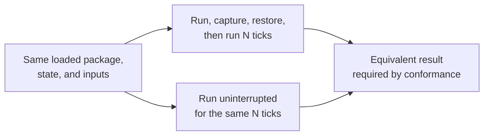

# Engine snapshots

**Status:** Current contract

**Maturity:** Preview

`EngineSnapshot` is the V1 platform contract for freezing and resuming an
engine world. It is a state format, not a storage service: callers decide
whether the JSON is kept locally, sent to a backend, or discarded.

## Contract

1. Load the same package and Luau source into an `Engine`.
2. Advance the engine normally.
3. Call `Engine::capture_snapshot_json()`.
4. Restore into a matching engine with `Engine::restore_snapshot_json()`.

The snapshot is versioned from its first release and carries a deterministic
fingerprint of the loaded package and script. Restoring a snapshot against
different content or a world that is not loaded fails before runtime state is
changed.

**Snapshot capture and restore boundary**



The snapshot format crosses an engine boundary; it does not itself provide
durable storage, account ownership, retention, or recovery.

V1 contains the simulation clock/tick, RNG state, local player transform and
velocity, health/respawn/checkpoint state, pending simulation events, mutable
build blocks, launch-pad state, NPC simulation state, interaction state, camera
state needed by movement, the generic DataModel graph, and pending script input
messages. It deliberately does not contain GPU resources, sockets, UI gesture
captures, remote-player presentation state, caches, or Lua VM/coroutine
internals.

Within the camera state, `targetDistance` is the player's requested zoom and
remains unchanged when world geometry obstructs the view. `distance` is the
effective resolved distance after smoothing and camera occlusion; local-avatar
hiding and fading use that resolved value.

## Game-owned state

Meaningful game state belongs to the game. A Luau package may implement:

```lua
function game.on_save(api)
    return {
        score = score,
        gates = gates,
    }
end

function game.on_restore(api, state)
    score = state.score
    gates = state.gates
end
```

The return value must be JSON-compatible. `on_save` is called by the engine
when capturing; `on_restore` is called during a validated restore before the
engine commits the new runtime state. A package without these hooks has a
`null` game-state blob. This keeps game rules in Luau while making persistence
explicit and portable across the native and browser runtimes.

## Deliberate V1 boundaries

- Static world definitions are content, identified by the fingerprint rather
  than duplicated in every snapshot.
- Snapshot restore clears the DataModel live change history. Consumers must
  create a new cursor after restore; persistence is a point-in-time state, not
  a replay log.
- Effects are presentation output and are rebuilt after restore.
- No Cloudflare, filesystem, or account persistence code is coupled to the
  engine. A future storage adapter should validate the format and size before
  handing bytes to the engine.

The conformance invariant is:



The headless engine test exercises this invariant without a window, GPU,
socket, or platform host.
