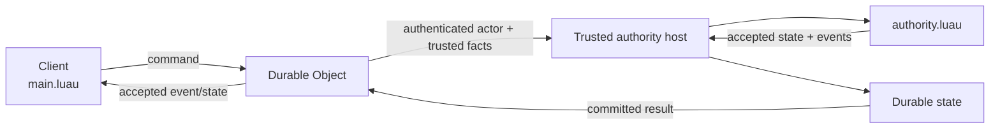

# Diagram conventions

Cubacadabra uses three deliberate visual layers:

| Layer | Use it for | Maintenance rule |
| --- | --- | --- |
| Designed SVG | Stable orientation, architecture, package and format schematics | Keep the visual language consistent; update when the canonical boundary changes |
| Mermaid | Living implementation flows, sequences, state machines and dependency graphs | Keep the source beside the authoritative prose |
| PNG / video | Screenshots, renderer captures, visual comparisons and measured evidence | Preserve capture context; never use pixels as the architecture specification |

GitHub renders Mermaid directly inside Markdown fenced blocks, so Mermaid is the
default for diagrams expected to change with implementation. Keep those blocks
near the authoritative prose that explains them. Standalone diagram source is
appropriate only when a diagram is reused, unusually large, or useful on its own.

Designed SVGs are reserved for stable ideas people should understand on arrival:
the platform map, runtime ownership, creator pipeline, cloud topology, Studio
boundary, compatibility stack, verification matrix, package anatomy, MorphPack
layout, creator lifecycle, and decision map.

## Visual language

Use the same restrained palette across flagship SVGs:

- creator/source — neutral white or slate
- shared Rust — subtle blue
- hosts/platform — subtle violet
- backend/trusted — subtle amber
- storage/assets — subtle green
- proposed or not yet integrated — dashed outline
- current path — solid connector

Keep text large enough to read on GitHub, use transparent backgrounds where
possible, and include a short status note when a graphic contains a proposed or
unverified boundary. The SVGs include accessible titles and descriptions so the
visual is not the only way to understand the claim.

## Current designed diagrams

- `cubacadabra-platform.svg` — root platform map
- `runtime-ownership.svg` — Rust layers, hosts and platform boundary
- `creator-runtime-pipeline.svg` — source to package to runtime
- `sdk-layering.svg` — runtime primitives to reusable Luau helpers
- `cloud-platform.svg` — Worker, Durable Object, D1, R2 and Queues
- `studio-system.svg` — project store, builder, preview and service edges
- `verification-matrix.svg` — current evidence boundaries by host
- `compatibility-stack.svg` — version axes and rejection rules
- `creator-lifecycle.svg` — create to publish to play
- `package-anatomy.svg` — portable package cutaway
- `morph-pipeline.svg` and `morph-pack-v5-layout.svg` — asset source and binary format
- `trusted-multiplayer.svg` — cooperative and proposed trusted authority paths
- `decision-map.svg` — foundational architecture decisions

The living authority example remains intentionally inline:

