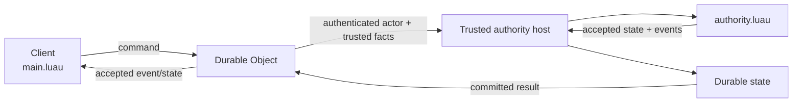

I’d make **Mermaid the default** for Cubacadabra technical diagrams, and use **real SVG/PNG only for the handful of diagrams that are important enough to be designed artifacts**.

GitHub renders Mermaid directly inside Markdown fenced blocks, and also supports standalone `.mmd` / `.mermaid` files. That makes Mermaid especially good for a canonical docs repo because the diagram source is text, diffable, reviewable, and easy for agents to update along with the prose. ([GitHub Docs][1])

For this project, I’d use Mermaid for things like:

* repo/platform architecture
* request/data flow
* client ↔ backend ↔ authority flow
* build/package pipelines
* Studio asset import flow
* state ownership diagrams
* sequence diagrams for login, save, publish, reconnect
* lifecycle/state machines
* dependency graphs

For example, your authority docs should absolutely have something like:



That is vastly preferable to a PNG for an evolving architecture.

## Why Mermaid should be the default

The big win isn't rendering. It's **maintenance**.

If someone changes:

```text
client
  ↓
Durable Object
  ↓
authority.luau
```

to:

```text
client
  ↓
Durable Object
  ↓
server container
  ↓
authority.luau
```

an agent can edit three lines in the same PR.

With a PNG:

```text
find original drawing file
open drawing program
move nodes
export image
replace PNG
hope source file was committed
```

That is exactly the sort of thing that eventually goes stale.

Mermaid also makes code review meaningful. Git diffs show that someone changed:

```text
DO --> WASM
```

to:

```text
DO --> Container
```

rather than:

```text
binary file changed
```

For a project being heavily maintained by coding agents, that matters a lot.

## But I would not force everything into Mermaid

Mermaid becomes ugly when you try to make a genuinely sophisticated systems diagram with:

* lots of nested zones
* icons
* elaborate annotations
* precise spatial grouping
* several dozen components
* multiple overlapping relationships
* polished marketing-quality visuals

At that point the diagram starts looking like a subway map drawn by a compiler.

For maybe **5–10 flagship diagrams**, I'd make designed graphics.

Examples:

### “Cubacadabra at a glance”

Something beautiful like:

```text
                CREATOR

      Studio    JSON    Luau    GLB
          \       |      |      /
           \      |      |     /
                BUILD
                  |
                  v
             Game Package
                  |
       ┌──────────┼───────────┐
       v          v           v
      Web        iOS       Android
       \          |           /
        \         |          /
          Shared Rust Runtime
                  |
                  v
             Platform
          /       |       \
      Authority Storage  Assets
```

That might be worth a polished SVG.

Likewise:

* overall platform architecture
* full creator lifecycle
* Studio conceptual architecture
* multiplayer/trusted authority architecture
* asset pipeline from Blender → source → compiler → package → CDN/runtime

Those are the diagrams people will stare at repeatedly.

## Prefer SVG over PNG for designed diagrams

For technical line diagrams, I’d usually choose:

**SVG > PNG**

GitHub renders SVG files. ([GitHub Docs][1])

Advantages:

* sharp at every zoom
* usually much smaller
* readable text
* works well on Retina displays
* easier to tweak programmatically
* can be generated from Figma/Illustrator/Inkscape/etc.

Use PNG primarily for:

* screenshots
* renderer captures
* visual comparisons
* art evidence
* something where the pixels themselves matter

So I’d establish this rule:

```text
Mermaid
    living technical diagrams

SVG
    carefully designed canonical diagrams

PNG
    screenshots / rendered visual evidence
```

## I would keep the Mermaid inline in the relevant `.md`

Don't create:

```text
diagrams/
    authority.mmd
```

and then make the reader jump around unless the same diagram is reused.

Prefer:

````text
architecture/authority.md

prose
prose

```mermaid
...
```

prose

````

The diagram and the explanation should usually change together.

Standalone `.mmd` files make sense only when:

- the same diagram is reused multiple places
- it is huge
- you want it viewable independently

GitHub supports those standalone files too. ([GitHub Docs][1])

## I'd actually add a diagram convention to the docs repo

Something tiny in the README or `CONTRIBUTING.md`:

> Use Mermaid for living architecture, flows, sequences, and state diagrams. Keep diagrams near the text they explain. Use SVG for intentionally designed overview graphics and PNG for screenshots/rendered evidence. Avoid hand-maintained PNG architecture diagrams when a Mermaid diagram can express the same information.

That prevents future agents from randomly generating images for everything.

## The first diagrams I'd add

You have a lot of text now that would benefit immediately. I’d probably do these first, roughly in this order:

1. **Whole platform architecture**
   `architecture/overview.md`

2. **Game source → build → package → clients**
   `contracts/game-package.md`

3. **Client / engine / app ownership**
   `architecture/overview.md` or separate runtime diagram

4. **Current cooperative multiplayer path**
   `architecture/authority.md`

5. **Future trusted authority path**
   same page, right under the current path

6. **Snapshot vs durable storage**
   `contracts/snapshots.md`

7. **Studio local Morph import flow**
   `studio/asset-workflow.md`

8. **Morph publish/catalog/download flow**
   `platform/morph-catalog.md`

9. **App action → effect → host HTTP → result → snapshot**
   `architecture/app-runtime.md`

10. **Client WebSocket lifecycle**
    `architecture/client-runtime.md`

11. **Prefab identity/reference model**
    `architecture/assets-and-prefabs.md`

12. **Documentation authority**
    Possibly even the docs README itself:
    `code/tests → contract → architecture → product/proposals`

I could easily see **20–30 Mermaid diagrams** across this repo without it feeling excessive.

One caution: Mermaid is good at communicating structure, but don't turn every paragraph into a diagram. A useful diagram should save the reader from mentally constructing relationships from the prose.

So my answer is: **go heavily Mermaid—probably 90% Mermaid, 5–10% polished SVG, and PNG only where you're showing actual visual output.**

[1]: https://docs.github.com/en/repositories/working-with-files/using-files/working-with-non-code-files?utm_source=chatgpt.com "Working with non-code files - GitHub Docs"
