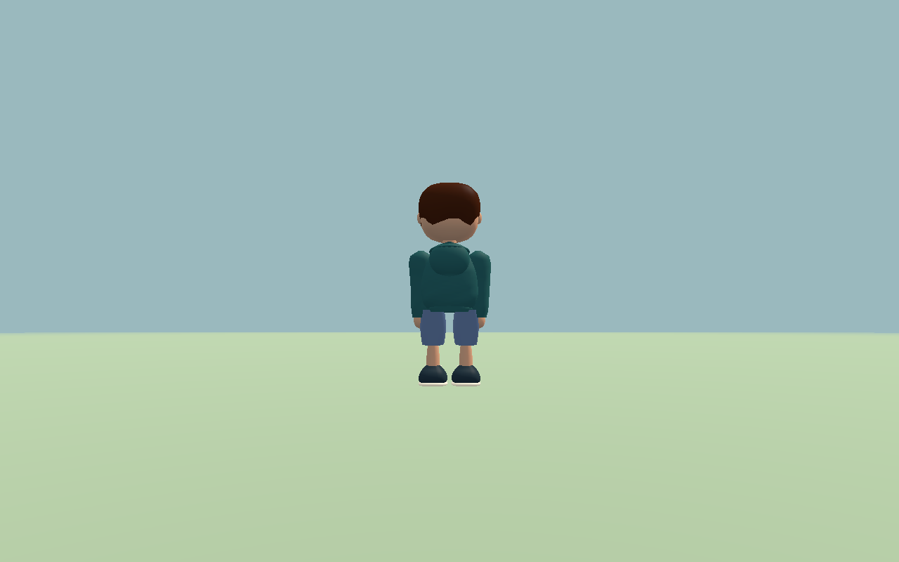

# Evidence

## Current visual evidence

<table>
  <tr>
    <td></td>
    <td></td>
  </tr>
  <tr>
    <td align="center">Racer Lab</td>
    <td align="center">Racer gameplay</td>
  </tr>
  <tr>
    <td></td>
    <td></td>
  </tr>
  <tr>
    <td align="center">Character runtime / laptop size</td>
    <td align="center">Character runtime / phone size</td>
  </tr>
</table>

This is a contact sheet of actual captures, not an abstract architecture
diagram. Each image remains evidence for the specific build or review described
by its owning page.

This directory holds selected, non-executable evidence that belongs with the
canonical design and verification records. Source code and test fixtures stay
with the implementation repository. Captures are evidence of a specific
review/build and are not automatically a claim of current approval.

- [Character/person studies and measurements](character/README.md)
- [Racer example captures](examples/README.md)

The original files remain in sibling repositories during this migration; see
the [source disposition ledger](../sources.md). They have not been deleted.
