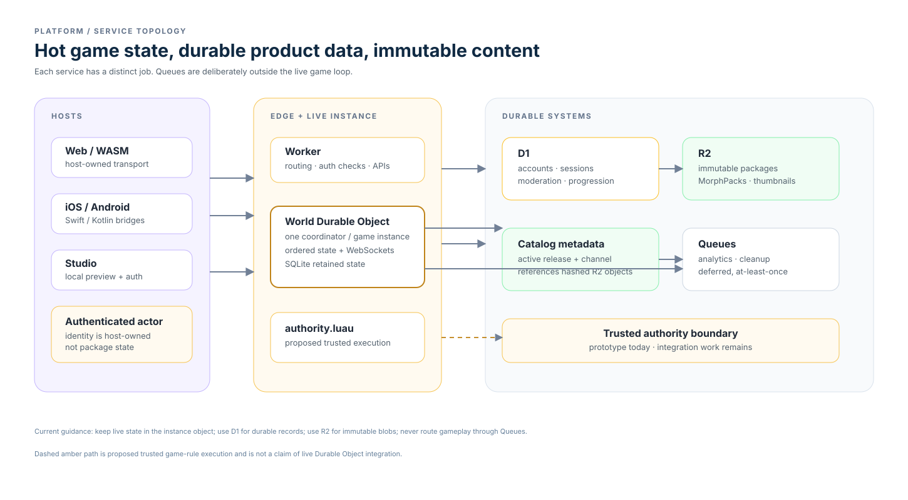
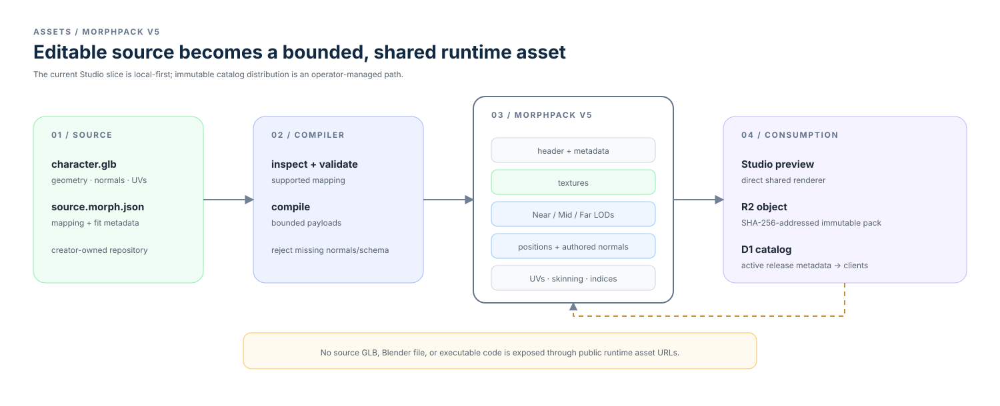

# Platform services

Platform services separate live coordination from durable product records and
immutable content: Durable Objects handle a live game instance, D1 holds
long-lived relational data, R2 serves versioned blobs, and Queues stay outside
the live game loop.

- [Backend storage](backend-storage.md) — data placement and operations.
- [Morph catalog and saved appearance](morph-catalog.md) — current read,
  immutable asset, and revisioned appearance contract.
- [Authentication](authentication.md) — host-owned credentials and server
  checks.
- [Moderation and safety](moderation.md) — current endpoints and open policy.
- [Publishing](publishing.md) — package distribution, cache integrity, and
  release boundaries.
- [Licensing](licensing.md) — current repository reuse policy.
