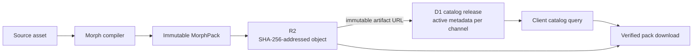
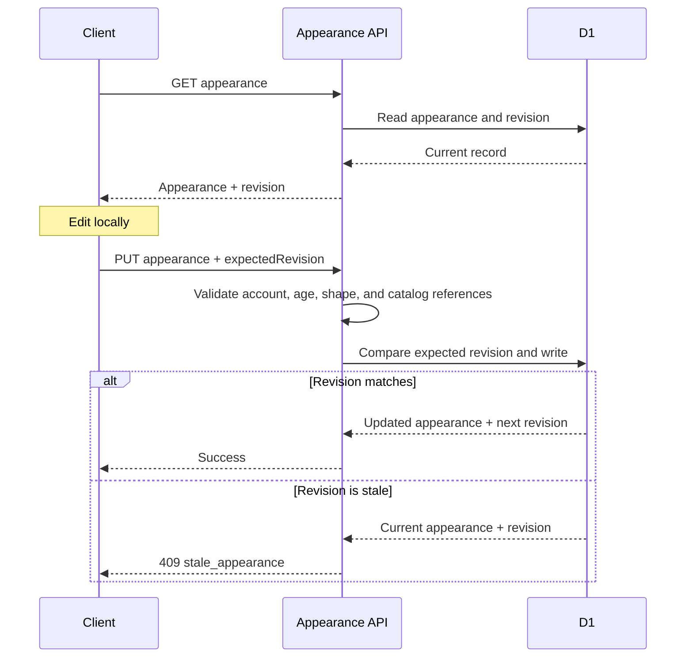

# Morph catalog and saved appearance

**Status:** Current backend contract at the reviewed backend revision.
Catalog release construction is operator tooling; this page describes the
client-facing read and saved-appearance paths.

**Current operator-managed catalog release and read path**



Catalog publication is currently a maintainer/operator workflow, not a public
client API or creator self-service flow.

## Catalog reads

`GET /morphs/catalog` is public and reads one active JSON catalog document for
the requested `channel` (defaults to `production`). `limit` defaults to 48 and
is capped at 100. Optional filters are `kind`, `base`, and `rig_profile`,
each at most 128 characters. A channel must be at most 64 characters and
match lowercase letters, digits, `_`, or `-`.

The cursor is a URL-safe base64 JSON object containing `{ releaseId, offset }`.
A cursor from a different active release returns `409 catalog_changed` and
the current release ID. A malformed cursor resets to the first page. The
success response contains `assets`, `presets`, `release`, and `nextCursor`.
The response is publicly cached for 30 seconds and includes an ETag derived
from the catalog hash.

An asset response includes its ID, kind, name, optional thumbnail, delivery
metadata, immutable artifact metadata/URL, base, slots, tags, and optional
definition. Pack URLs use the SHA-256 address and serve with a one-year
immutable cache header. The first two hex path characters must match the hash
prefix. Missing objects return 404; storage/catalog unavailability returns
503. Only valid 64-character lowercase SHA-256 paths are served.

Errors include `invalid_filter` (400), `invalid_channel` (400),
`catalog_changed` (409), `catalog_unavailable` (503), `morphs_unavailable`
(503), and `not_found` (404). Catalog publication is not a public client API;
the current compiler/publisher is an operator workflow.

## Saved appearance

`GET /auth/appearance` and `PUT /auth/appearance` require an authenticated
account with a recorded eligible age (13 or older). A user with no saved
record receives a version-2 default appearance at revision 0.

The update body is `{ "expectedRevision": integer, "appearance": object }`.
The appearance request is limited to 32 KiB. If the expected revision differs
from the stored revision, the service returns `409 stale_appearance` with the
current appearance and revision. A successful write advances revision by one
and returns the normalized appearance and revision. Invalid bodies or
catalog references return `400 invalid_request` or `400 invalid_appearance`;
auth failures return `401 not_authenticated`, age failures return
`403 age_required`, and service failures return `503 auth_unavailable`.

**Revision-checked appearance save**



### Version 2 loadout

```json
{
  "version": 2,
  "base": "cuba:base/person.v1",
  "parts": ["cuba:hair/swept.v1", "cuba:everyday-hoodie.v1"],
  "parameters": {},
  "face": null
}
```

`base` is a required string of at most 128 characters. `parts` is optional,
defaults to an empty array, and accepts at most 32 IDs of at most 128
characters each. `face` is optional/null or an ID of at most 128 characters.
`parameters` is an optional object and defaults to `{}`. The base ID must
resolve to a `base` catalog asset; face must resolve to a `face` asset; parts
must resolve to assets that are neither `base` nor `face`. Unknown IDs are
rejected. The legacy `users.body_id` is reset to the default projection on a
v2 save.

### Legacy appearance

The legacy form accepts a supported `body`, optional `equipment` object, and
optional `wearables` array. Body IDs are normalized through the legacy body
allowlist. Equipment and wearable IDs are length-checked and, when present,
must exist in the production catalog. Legacy saves update the `body_id`
projection. Exact old-to-new ID mappings are in
[Morph migrations](../compatibility/morph-migrations.md).

## Storage shape

D1 `morph_catalog` stores one current catalog JSON and release identity/hash
per channel; it is not a row-per-asset catalog. Packs and thumbnails live at
immutable SHA-256-addressed R2 keys. `user_appearances` stores JSON by user ID
with an integer revision and update time. The legacy body field remains a
compatibility projection.

## Publishing safety criteria

**Status: Proposed release requirements; implementation status is not yet
verified across every publisher and host.**

These are release requirements distilled from the older product plan; they
are not a claim that creator self-service publishing exists:

- Serve constrained runtime packs and approved thumbnails. Do not expose
  source GLB/Blender/sidecar files through public runtime asset URLs.
- Validate schema, byte limits, required content, hash, and compatibility
  before activation.
- Upload immutable assets first. Do not activate catalog metadata that points
  to missing R2 objects; a failed catalog update must leave the previous
  complete release active.
- Treat a saved appearance that references a removed asset explicitly; never
  silently substitute a different asset.
- Keep player saves revision-checked and validate every referenced asset on
  the server.
- Runtime package data must not carry executable scripts, shaders, or
  arbitrary code.

If photo-to-avatar input is introduced, consent, private source storage,
non-distribution of source photos, biometric-data retention, and child safety
need separate review before implementation. No photo-to-avatar flow is part
of the current contract.
