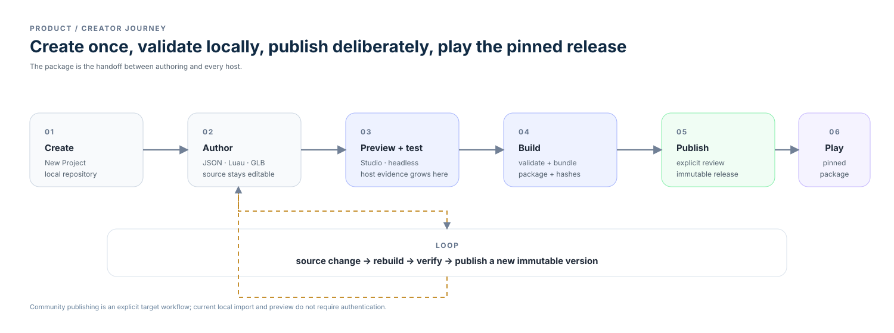

# Product

The product thesis is a creator loop that stays inspectable and local while
producing a portable package that can be verified and played across hosts.

- [Platforms](platforms.md) — Studio versus Player, target products, and
  current/planned platform coverage.
- [Vision](vision.md) — product direction and current non-promises.
- [Principles](principles.md) — established, proposed, and superseded rules.
- [Creator model](creator-model.md) — source ownership, clean-machine
  workflow, local authoring, and explicit sharing.
- [Character direction](character-direction.md) — active art focus and review
  status.
