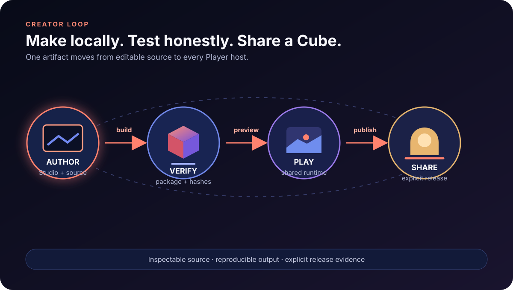

# Products

Cubacadabra has two product surfaces and one shared promise: creators author
locally in Studio, while players experience the same portable game through a
host appropriate to their device.

- [Studio](studio/README.md) — local authoring, import, build, and preview.
- [Player](player/README.md) — the end-user hosts: [Web](player/web.md),
  [iOS](player/ios.md), [Android](player/android.md), and [Desktop](player/desktop.md).
- [Characters](characters/README.md) — Morph direction, evidence, and runtime constraints.
- [Vision](vision.md) and [platform model](platforms.md) — product boundaries and current coverage.
- [Creator model](creator-model.md) and [principles](principles.md) — durable product decisions.
