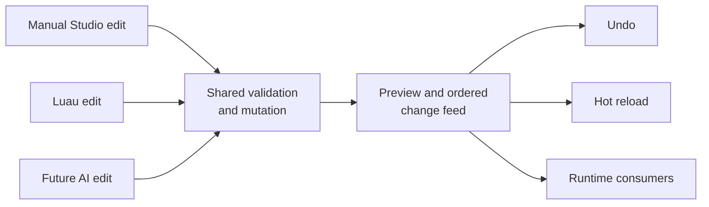

# Studio editing model

## Durable direction

Manual edits, Luau-driven changes, and future AI-assisted edits should enter
one command/mutation pipeline with validation, preview, undo, change tracking,
and hot reload. This is a proposed architectural requirement, not a claim that
the complete editor transaction system exists today.

The Rust `DataModel` currently provides a stable entity graph and ordered,
bounded mutation feed. It is not yet a complete Luau `Instance` surface or a
bridge to renderer, physics, networking, and persistence. Future integrations
should build on the shared mutation feed rather than add parallel setters or
per-frame scans. See [DataModel](../../systems/runtime/data-model.md).

**Proposed shared editing pipeline**

The project-owned `cubacadabra-scene` crate is now the canonical source model
for authoring nodes, transforms, components, validation, and world/local
transform math. Studio and the builder consume that model directly; the
builder no longer owns the scene types. Studio still has a transitional
source-string history and preview overlay, which are the next migration steps
toward command-sized transactions and live editor rendering.

Studio keeps stopped authoring separate from runtime play. Selection and editor
camera navigation are host-owned presentation state and never mutate the local
player. Play saves and rebuilds stale authoring source, then temporarily hands
the viewport and movement controls to the embedded runtime; Stop restores the
preserved editor camera. Object dragging, quarter-unit camera-relative arrow
nudges, duplication, inspector edits, undo, and future agent edits all feed the
same source transaction path.

Renaming, primitive appearance changes, and hierarchy reparenting also use this
path. Reparenting is a source-model operation that preserves world placement
and rejects cycles or transforms that would introduce unsupported shear; it is
not a presentation-only tree rearrangement.

On the first supported world edit to a manifest-only project, Studio converts
the active world's supported object collections into scene components and
removes the migrated arrays from the source manifest before presenting either
file as dirty. The conversion either succeeds as one in-memory source
transition or leaves both sources unchanged; unsupported legacy decorations
still stop it rather than losing data.

## Acceptance scenario

1. Import a project-owned texture and see all relevant viewports update.
2. Adjust an object's placement and material through manual editing.
3. Run the game with two players and observe consistent changes.
4. Undo the edit and verify the source and preview return to the previous
   valid state.
5. Make the same change through a Luau command and, when AI editing exists,
   through an agent command; validate, preview, track, and undo each through
   the same editing model.

This scenario is a proposal extracted from the Studio plan. It does not make
the proposed workspace, asset browser, timeline, or panels a committed product
scope.
