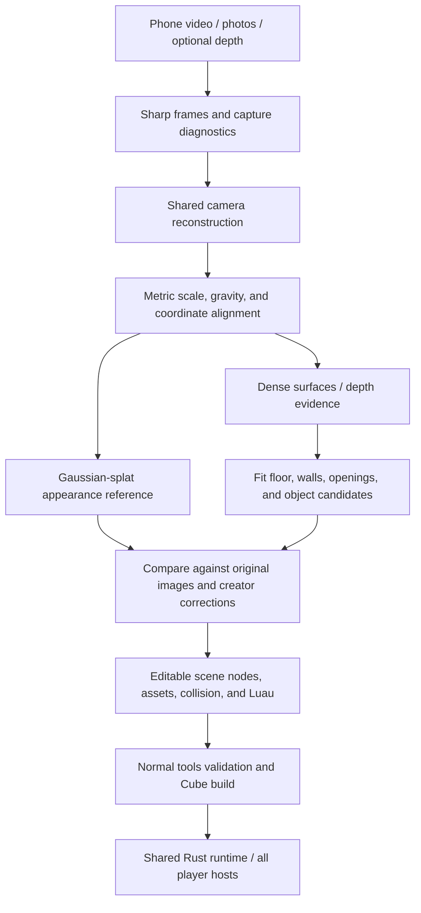

# From a room capture to a playable Cubacadabra world

**Status:** Video intake, sparse camera recovery, and reviewed metric alignment
implemented; dense reconstruction and playable-world stages remain a proposal.
Creator-source formats are defined by the [capture](../../contracts/room-capture.md)
and [camera-reconstruction](../../contracts/room-reconstruction.md) contracts.

Capture a real room with a phone, reconstruct its appearance, and turn it into
an editable game environment. Cubacadabra can do this better than a workflow
that ends at a mesh import: preserve the photographic reference, reconstruct
clean gameplay geometry, and give meaningful objects their own identity and
behavior. Later, a native Gaussian-splat renderer could preserve more of the
captured appearance without forcing every detail through mesh conversion.

The first deliverable should be a small room that loads through the normal
Cube pipeline, has reliable floor and wall collision, and can be edited in
Studio. Photorealism and native splats are separate milestones.

## What changes from the Roblox approach

The useful idea in the two-path pipeline is separating appearance from solid
geometry. Cubacadabra should retain that separation all the way into authoring
and, if measurements justify it, into rendering.

| Concern | Cubacadabra approach |
| --- | --- |
| Photographic appearance | Preserve frames, calibrated cameras, and a splat reference; optionally compile a runtime splat later. |
| Solid surfaces | Fit clean room geometry and use simplified meshes where fitting is insufficient. |
| Collision | Author and validate it independently of visual detail. |
| Object identity | Stable scene nodes with composable components, not objects inferred from GLB nodes. |
| Gameplay | Explicit interactions and game Luau attached to reviewed objects. |
| Optimization | Compile source into measured visual batches and reusable assets without flattening editable identity. |
| Portability | One package and shared Rust semantics across Studio and player hosts. |

Do not inherit another platform's mesh limits or class taxonomy. Choose
Cubacadabra budgets from actual loading, memory, rendering, and collision
measurements. Roblox export can be a separate downstream target if desired;
it should not constrain native source.

## Current foundation and missing capabilities

Studio now starts the workflow at **File → Import From → Room Video (experimental)…**. This
opens a compact local import/review dialog, available without an open game.
The shared Rust `tools` crate inspects a video, selects sharp frames across its
timeline, reserves evaluation frames, and writes a new capture dataset. The
same operation is available through `cubacadabra capture-video`. FFmpeg is the
optional decoder prerequisite; Python and the `splat-local` application are
not dependencies. Camera recovery is a separate optional COLMAP stage;
dense geometry, splat training, and scene conversion are not implemented.

After frame review, **Recover cameras** runs the shared `tools` adapter. Studio
can also reopen `capture.json` or `reconstruction.json`. The result includes
typed intrinsics/poses, a sparse cloud, original point observations, registration,
reprojection, and parallax diagnostics. Studio shows camera and point evidence
and supports a measured-distance anchor plus three reviewed floor points for
metric scale, orientation, and origin. Separate reconstructions stay separate;
small pixel error does not certify accurate depth. The CLI exposes the same
operations as `recover-cameras` and `align-capture`.

The next implementation milestone is dense surface recovery from reviewed
cameras, followed by supported textured visual geometry and explicit floor/wall
collision. Reuse the shared camera and alignment result across the later
appearance and solid-geometry branches. Use the checked-out
`splat-local` stages as comparative evidence; own the adapters and result
format rather than embedding its server or copying its Python orchestration.

The [toolchain](../../systems/toolchain/overview.md) already separates editable
`scene.json` source from compiled packages. The
[asset model](../../systems/assets/assets-and-prefabs.md) separates GLB visual
data from world semantics. These are the right foundations for room capture.

The [current package contract](../../contracts/game-package.md#asset-declarations)
supports static GLB geometry, normals, UVs, optional vertex colors,
package-atlas albedo, and instancing. Explicit static triangle collision is a
separate [world capability](../../contracts/world-manifest.md#static-triangle-collision).
It does not establish general embedded GLB material extraction, full PBR-map
import, animated imported meshes, or a native splat asset pipeline.

Therefore the first prototype must export the supported visual subset and
explicit collision. Opening doors, arbitrary movable furniture, relightable
scans, and native splats require additional work; an imported scan does not
automatically provide those capabilities.

## One reconstruction, several outputs

Reuse frame selection, calibration, camera poses, and alignment across both
branches. Independently solving the same cameras twice wastes work and can
leave the splat and mesh at incompatible scales or origins.

RGB reconstruction alone does not supply reliable absolute scale. Ask for a
known distance, such as a measured doorway width, or use calibrated depth when
available. Record units, axes, origin, and the reconstruction-to-world transform
once. Apply it consistently to visuals, camera poses, collision, and objects.
Depth support should be optional, with device calibration retained as evidence.

## Capture and reconstruction

Start with one small, static room. A 30–60 second walkthrough is a starting
experiment, not a capture guarantee. Coverage and sharp overlapping views
matter more than duration. Move slowly with translational motion, revisit the
starting area, and capture furniture from several sides. Keep exposure and
white balance consistent where possible. Add still photos for missed areas.

Detect blur, weak overlap, unregistered frames, and disconnected reconstructions
before committing to expensive training. Show where another pass is needed.
Mirrors, glass, glossy surfaces, blank walls, moving people, and hidden surfaces
need explicit diagnostics rather than invented certainty.

[splat-local](https://github.com/michael-L-i/splat-local) is a useful local
reconstruction reference: its documented native path uses COLMAP/GLOMAP camera
recovery and Brush training, with PLY and optional SPZ export. Its browser
creator is a separate experimental path. Cubacadabra should evaluate its stages
through an adapter rather than assume its complete application is the product.

[video-to-3dgs](https://github.com/imcmurray/video-to-3dgs) demonstrates the
parallel-output idea with COLMAP, OpenMVS, Blender, and Brush. Its documented
tested environment is Linux with an NVIDIA GPU; that is useful prototype
evidence, not proof of a portable Studio dependency.

Pin tool revisions and reconstruction settings. Keep heavy reconstruction
dependencies in an optional creator tool environment, outside player packages
and the ordinary Studio build path. Record device, runtime, peak memory, and
failure rate on Cubacadabra's own captures before selecting a default backend.

## Turn evidence into editable objects

A splat is an appearance reconstruction, not ground truth. It can contain
floaters, missing surfaces, and view-dependent artifacts. Use original images,
camera consistency, depth where available, and creator measurements to check it.

Use geometry algorithms for plane fitting, topology, transforms, and collision.
Use vision models to suggest segmentation and semantic labels. A model can
suggest “door” or “lamp”; it cannot establish a hinge, clearance, support, or
physical dimensions from a label alone.

| Captured feature | Suggested authored result | Creator check |
| --- | --- | --- |
| Noisy wall or floor | Clean planar visual surface and solid collision proxy | Alignment, thickness, and missing openings |
| Door | Separate node, frame, and opening | Swing direction, hinge, and walkable clearance |
| Desk or couch | Simplified visual mesh and conservative collision | Footprint, support, and accessible surfaces |
| Lamp or monitor | Separate candidate prop | Whether it should become an interaction or light |
| Small clutter | Static detail mesh or baked texture | Whether any item needs independent gameplay identity |
| Mirror or unseen region | Flagged uncertainty and manual repair | Whether to omit, replace, or recapture |

Represent approved objects in the shared tools-owned authoring model using
stable IDs, hierarchy, transforms, and supported components. Keep suggestions,
confidence, evidence views, and rejected candidates in import provenance rather
than inventing runtime classes for every recognized household object.

Creator corrections should survive reconstruction reruns. Preserve IDs through
explicit source mappings; ambiguous matches should become reviewable conflicts.
Never silently overwrite hand-edited geometry or scripts with fresh inference.
Group accepted edits into undoable operations through the normal editing path.

A room import should be useful even when nothing is recognized: a supported
static visual mesh plus reviewed floor/wall collision is a valid first result.

## Appearance: mesh first, hybrid later

### First release: supported textured geometry

Bake appearance from the original calibrated images onto cleaned meshes.
Use splat renders as comparison views or supplemental evidence, with their
uncertainty retained. Export UV geometry and declared image atlases that match
the current package contract; export collision separately.

Captured color includes shadows and illumination. It is not automatically
physical albedo. Generating normal, roughness, and metalness maps from RGB is
an estimate, and baking old shadows then adding runtime shadows can double the
lighting. Compare the result under the supported renderer before describing it
as relightable PBR. Better material extraction and illumination separation are
separate research and renderer tasks.

### Experimental release: native splats plus gameplay geometry

Cubacadabra owns its renderer, so it could eventually render splats directly
for static detail while meshes supply collision and editable props. This is the
main opportunity beyond using splats only as a mesh-baking reference.

It also creates real implementation problems: depth and transparency ordering
with meshes and characters, overdraw, culling, compression, memory, loading,
and quality under camera movement. Captured lighting remains baked into the
appearance unless a different representation is developed.

Do not render a full scanned couch behind a movable replacement couch. The
original will remain visible when the replacement moves. Remove or mask the
corresponding splats and rebuild the background; unseen surfaces require
recapture or an explicitly accepted repair. The same issue applies to doors,
destruction, and rearranging furniture. Store authoring mappings for these
regions separately from an optimized splat encoding.

Start with splats for static background regions. Gameplay surfaces and movable
objects remain explicit geometry. Avoid promising arbitrary dynamic splats,
automatic relighting, or complete room editing in the first experiment.

Any runtime splat asset needs a versioned contract, declared immutable content
identity, bounded decoding, and host compatibility evidence. Keep it behind an
experimental feature until the shared Rust renderer and real Web, iOS, Android,
and Desktop paths are verified. A Studio-only viewer does not prove portability.
Specify a mesh fallback and explicit unsupported-version behavior before
shipping packages that depend on it.

Mesh extraction from Gaussians is an alternative experiment.
[CoMe](https://github.com/r4dl/CoMe) provides an implementation of
confidence-based mesh extraction. Compare it against conventional reconstruction
on the same captures; do not assume extraction preserves photographic fidelity
or yields game-ready collision and object separation.

## Source, builds, and repository ownership

Keep capture provenance, tool versions, scale anchors, corrections, and asset
references inspectable. Store bulk video, images, meshes, and splats as ordinary
assets rather than huge inline JSON arrays. Every checked-in JSON file must
remain at or below 4,000,000 bytes; shard import datasets when needed.

Separate stochastic reconstruction from deterministic package construction.
Freeze reviewed reconstruction outputs as source dependencies; the normal
build should reproduce the Cube from those assets and pinned inputs without
retraining a model. Published packages include only declared runtime assets,
not raw footage, private images, camera histories, or machine-local cache paths.

| Repository | Responsibility |
| --- | --- |
| `tools` | Reconstruction adapters, diagnostics, shared scene conversion, asset preparation, validation, and package construction |
| `studio` | Capture import workflow, evidence comparison, corrections, undo, and preview through the normal builder/runtime |
| `rust` | Shared collision and rendering semantics; experimental splat loading/rendering if adopted |
| Player hosts | Device capture integration where offered, presentation, and platform adapters |
| `backend` | Existing package delivery and service validation; optional explicit reconstruction jobs later |
| Game project | Room-specific interactions and rules in Luau |
| `docs` | Canonical contracts and cross-host acceptance evidence |

Default to local processing. A room capture may contain faces, documents,
screens, and location clues. Offer review and masking before reconstruction
artifacts are shared; deleting footage alone does not remove details already
baked into textures or splats. Cloud processing, if added, should be an explicit
choice with clear retention behavior.

## A concrete first prototype

1. Capture one room, measure one reference distance, and retain a few views for
   evaluation rather than training.
2. Recover shared cameras and build both a splat reference and dense geometry.
   Record elapsed time, tool versions, failed views, and resource use.
3. Manually confirm floor, walls, scale, and an unobstructed spawn. Automate
   plane fitting and conservative collision before attempting broad semantics.
4. Produce supported GLB visuals, image atlases, static collision, and editable
   source. Build and preview with the existing native toolchain.
5. Give one reviewed object a supported interaction in game Luau. Treat a
   physically opening door as a later capability unless its full visual and
   collision behavior is implemented together.
6. Compare mesh output with the splat and withheld images. Test a native splat
   rendering spike only if the remaining visual gap justifies its cost.

The experiment succeeds when the room is recognizably reconstructed, correctly
scaled, navigable, editable, and reproducibly packaged. It need not recognize
every object or achieve photorealistic rendering to establish a useful workflow.

## Evidence required before making product claims

Use the same small capture set for every candidate: a textured room, a room
with blank walls, reflective surfaces, clutter, and a capture with motion or
missing coverage. Record failures as well as successful examples.

- **Appearance:** compare withheld viewpoints and normal player movement;
  inspect holes, floaters, ghosting, seams, and captured lighting artifacts.
- **Geometry:** check known dimensions, floor height, wall alignment, openings,
  spawn clearance, and visual/collision agreement.
- **Gameplay:** exercise player and camera collision, narrow passages, and
  supported object interactions; verify changed objects do not leave duplicates.
- **Editing:** move an accepted object, save/reload, undo, rebuild, and rerun
  reconstruction while preserving creator corrections and stable references.
- **Builds:** inspect emitted packages, declarations, hashes, and omitted source
  data; test missing assets, invalid geometry, and unsupported versions.
- **Performance:** measure package bytes, decode time, peak CPU/GPU memory,
  frame-time distributions, draw calls, overdraw, and collision query cost.
- **Hosts:** exercise actual package loading and room traversal in each
  available host. Name unavailable devices or toolchains explicitly.

Set acceptance budgets against a recorded device and renderer baseline using
the [performance guidance](../../quality/verification/performance.md) and
[host conformance](../../quality/compatibility/host-conformance.md). A claim
such as “90% visually similar with 1–5% of the geometry” needs a defined metric
and measured captures. Triangle count alone cannot compare meshes with splats.

The product advantage is a room that can become a game through ordinary
Cubacadabra editing and Luau, while retaining enough reconstruction evidence
to improve its appearance over time. The mesh path establishes that workflow;
native splats are a measured extension of it.
