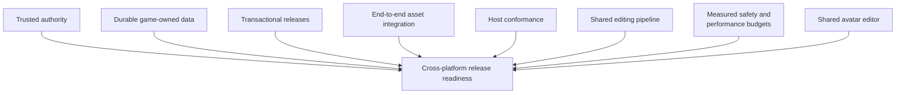

# Roadmap and open work

This is a current cross-repository gap list, not a schedule, release promise,
or requirement to implement every proposal in the historical source material.
Feature terms and evidence labels follow the
[documentation authority rules](README.md#documentation-authority).

**Major unfinished platform areas**



This is a gap map, not a schedule or an assertion that the areas can be
completed independently. The sections below define their current foundations
and remaining evidence.

## Working foundations

- The tools builder produces package format 3 and accepts SDK `0.3.0` and
  `0.4.0`; terrain requires `0.4.0`. Packages include generated Luau and
  integrity metadata. The native CLI is the sole expander for Maze 101's
  bounded procedural declaration, and the generated package loads through the
  Rust headless runtime. See [package contract](../contracts/game-package.md).
- Rust provides shared engine, client/session, application-state, and bounded
  Luau runtime foundations. Web uses generated WASM; iOS and Android use
  native bridges; Studio calls Rust directly.
- The network service provides server-assigned presence, validated service
  requests, and ordered cooperative retained state. Compare-and-set prevents
  lost writes; it does not validate game-rule meaning.
- Studio creates local projects and imports/validates/previews supported GLB
  assets. Project-local catalog update, manifest declarations, and
  reproducible package use on every client are not yet one integrated path.
- SDK helpers cover cooperative shared state, obby and survival lifecycle,
  disclosure, and a local two-phase cycle. Exact behavior lives in
  [SDK contracts](../contracts/sdk/README.md).
- Engine snapshots, deterministic headless runs, bounded UI/effects/audio,
  simulation-time tasks, static terrain, package assets, and MorphPack v5
  have explicit contracts.

The Maze 101 package is now a verified native-build milestone: its source
declaration produces a self-contained terrain maze with twelve collectibles,
four checkpoints, generated effects, a package-owned authored island shell,
and a separately hashed authority entry. The shared renderer and all supported
hosts now have the embedded static GLB world-mesh path, including indexed
instancing and directional shadows. There is not yet Cubacadabra visual
capture evidence for the Maze 101 package itself, live backend authority
execution, or durable completion rewards.

## Open work

### 1. Integrate trusted game authority

The Rust `AuthorityBoundary`, Luau adapter, portable server runtime, and
`authority.luau` artifact are prototypes. The live Durable Object does not yet
execute game-owned rules. Production authority needs authenticated actor
binding, trustworthy world/movement facts, bounded game-owned execution,
atomic persistence of accepted state and request receipts, and publication
only after commit. Client-reported movement is not collision evidence. Test
every alternate mutation route for bypasses before protecting rewards.

### 2. Define durable game-owned data

Engine snapshots represent an in-memory running world and optional explicit
game state; they are not a creator database. Durable inventory, progression,
and rewards need ownership/access rules, schema migrations, quotas,
concurrency, reconnect/restart, deletion, recovery, and transactional writes.

### 3. Make build and release activation transactional

The tools builder stages directory output and preserves an earlier successful
package when a build fails. Directory and ZIP outputs are not one atomic
transaction. Hosts validate different portions of package contents and retain
different caches. Stage and verify every required asset, then activate one
immutable package revision. Interruption tests must leave a complete old or
new release, never a mixed set; see
[acceptance criteria](../quality/verification/acceptance-criteria.md).

### 4. Complete the remaining native tools command surface

The creator-critical Rust project and builder crates are now implemented, and
Studio uses the builder in-process. Studio release artifacts ship a native
`cubacadabra` builder without Python or `cubacadabra.pyz`. The compatibility
harness and example-upload build step now invoke that same native builder.
Python remains only for maintainer-side authentication, local-service, and
Morph-release commands that are not package building. See the
[creator build toolchain](../systems/toolchain/overview.md).

### 5. Finish local Morph asset integration

Studio imports and locally previews supported rigid-wearable GLBs, writes the
source/sidecar/pack/thumbnail, updates the local catalog, and registers the
pack with its renderer. The action does not currently wire the asset into
`manifest.assets.morphPacks`. Prove manifest wiring, package hashes, and the
same asset loading on Studio, web, iOS, and Android. Creator-facing community
publish remains an operator-managed release path, not a self-service Studio
feature.

### 6. Prove host behavioral conformance

Keep native Rust and browser Luau outcomes equivalent and exercise real web,
iOS Swift/C, Android JNI/Kotlin, and Studio loader/cache boundaries. Compare
callback order, module cache behavior, task scheduling, JSON conversion,
structured failures, SDK transitions, and asset loading. Rust target
compilation is not an Android device test. See
[host conformance](../quality/compatibility/host-conformance.md).

### 7. Complete the shared editing pipeline

The generic `DataModel` currently supplies a stable entity graph and ordered
mutation feed; it is not yet a Luau `Instance` surface or connected to every
consumer. Manual Studio edits, Luau, and future AI edits should converge on
shared validation, changes, preview, undo, and hot reload. See the proposed
[editing model](../products/studio/editing-model.md) and the proposed
[large-world scene authoring plan](../products/studio/roblox-style-scene-authoring-plan.md).

### 8. Set measured service, safety, and performance budgets

Choose targets from real measurements for package startup, asset decode,
memory, frame time, network traffic, concurrent sessions, and long sessions.
Define public-content permissions, review, reporting, takedown/appeal,
privacy/data deletion, resource limits, and support operations before broad
public creator distribution. Current block/report endpoints do not complete
that policy.

### 9. Deliver the shared avatar editor surface

The backend catalog and revision-checked saved-appearance paths are current
contracts. The standalone editor remains proposed until web, iOS, and Android
prove the same Rust composition, local preview events, catalog browsing, and
save-conflict handling at their real host boundaries. Follow the target
ownership and event seam in [the avatar editor architecture](../systems/assets/avatar-editor.md).

### 10. Close the release-readiness gate

The proposed production checks in [release readiness](../quality/verification/release-readiness.md)
need owners, thresholds, and repeatable evidence before a stable SDK release
can be claimed. This includes authenticated soak and malformed-message tests,
host and accessibility conformance, permissions, observability, and measured
performance budgets.

### 11. Measure and optimize compiled runtime packages

The Vegas package is a useful proof that the source/runtime boundary is working:
the native build emits a small runtime-only archive, omits the imported Roblox
hierarchy and other authoring-only files, resolves source collision into the
runtime manifest, and leaves no source-index references for hosts to interpret.
Keep this as a regression fixture and make package-content checks verify the same
properties for future imported worlds. The `assets/` convention must remain
strict: it contains material intended to ship, while `imports/`, `reference/`,
`scene.json`, and `src/` remain authoring inputs.

The remaining optimization is runtime representation, not source cleanup. A
large baked collision mesh can make `manifest.json` expensive to parse and hold
in memory even when the archive compresses well. Measure package startup,
manifest parse time, and peak memory on representative imported worlds, then
evaluate a separately versioned derived collision asset or another compact world
representation, for example:

```text
manifest.json
assets/collision/vegas-floor.collision
```

with a manifest reference to that asset. Any such change must preserve the
text-first authoring source, explicit package hashes, bounded validation,
backward compatibility, and real host-loader evidence. It is not a reason to
ship `scene.json`, source shards, Roblox provenance, or authoring collision
documents to player hosts.

## Open decisions

- Whether a general-purpose scene/prefab encoding needs a binary form. JSON is
  current; identity and reference requirements apply regardless of encoding.
- Whether trusted game rules first run in a Worker/WASM Durable Object or a
  separate host. The generic command boundary is independent of deployment.
- How far more application state should move into shared Rust. Share semantic
  decisions where it removes real drift; keep OS UI and accessibility in hosts.
- Whether to adopt the pricing principles in
  [product principles](../products/principles.md). Exact price tables remain
  discarded speculation, not commitments.
- Which platform-facing AI editing integration to use. The durable requirement
  is one validated editor pipeline; Codex/App Server details in old notes are
  not a current product or dependency decision.

No release date, SDK 1.0 gate, or pricing tier is established by historical
plans.
