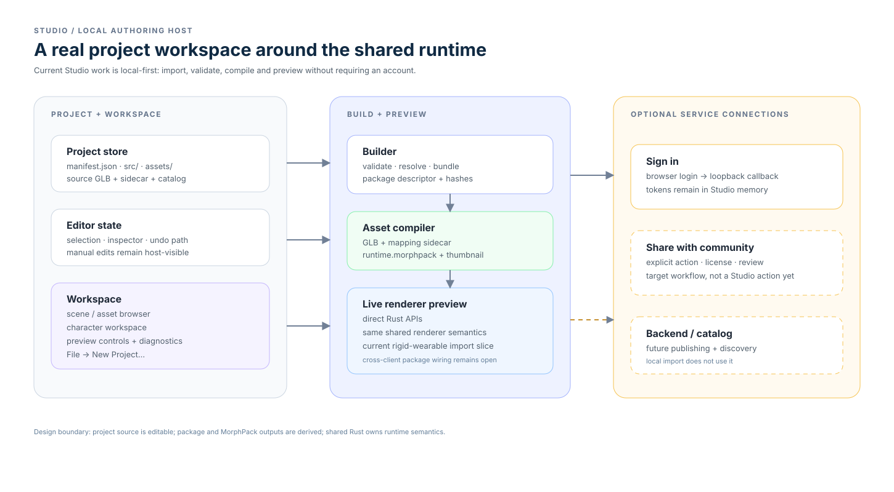

# Studio

Studio is the local authoring and preview host. Its current strongest boundary
is local-first GLB import, validation, compilation, and live renderer preview;
community publishing remains an explicit target workflow rather than a shipped
editor action.

Studio is creator software, not the end-user desktop Player. Its Play mode
embeds the same runtime so creators test the same package players will run.

- [Overview](overview.md) — editor purpose, prerequisites, and current limits.
- [Creator build toolchain](../architecture/toolchain.md) — native builder
  migration and the no-Python Studio release target.
- [Asset workflow](asset-workflow.md) — local GLB import, validation,
  project ownership, and unresolved package wiring.
- [Editing model](editing-model.md) — proposed shared edit path and an
  end-to-end acceptance scenario.
