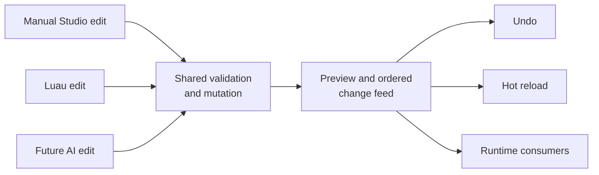

# Studio editing model

## Durable direction

Manual edits, Luau-driven changes, and future AI-assisted edits should enter
one command/mutation pipeline with validation, preview, undo, change tracking,
and hot reload. This is a proposed architectural requirement, not a claim that
the complete editor transaction system exists today.

The Rust `DataModel` currently provides a stable entity graph and ordered,
bounded mutation feed. It is not yet a complete Luau `Instance` surface or a
bridge to renderer, physics, networking, and persistence. Future integrations
should build on the shared mutation feed rather than add parallel setters or
per-frame scans. See [DataModel](../architecture/data-model.md).

**Proposed shared editing pipeline**

Only the generic `DataModel` graph and bounded mutation feed are implemented
foundations today. The complete cross-source editing transaction is proposed.

## Acceptance scenario

1. Import a project-owned texture and see all relevant viewports update.
2. Adjust an object's placement and material through manual editing.
3. Run the game with two players and observe consistent changes.
4. Undo the edit and verify the source and preview return to the previous
   valid state.
5. Make the same change through a Luau command and, when AI editing exists,
   through an agent command; validate, preview, track, and undo each through
   the same editing model.

This scenario is a proposal extracted from the Studio plan. It does not make
the proposed workspace, asset browser, timeline, or panels a committed product
scope.
