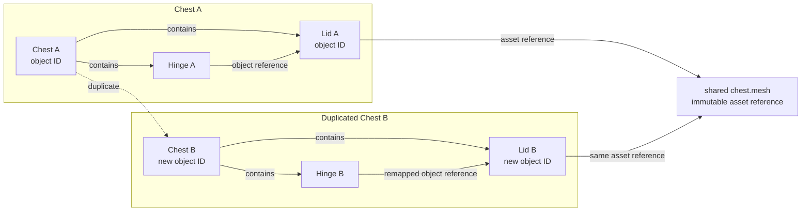
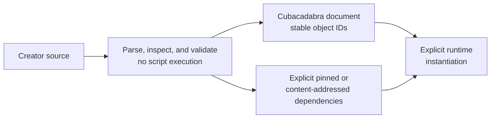

# Assets, authored documents, and prefabs

## Authored data and runtime data

JSON is the current authored representation for game manifests and world
descriptions. Packages carry game code plus explicitly declared assets. A
`.morphpack` is a versioned compiled character-asset format; it is not a
general scene or prefab format. No general-purpose binary counterpart to JSON
has been selected.

Keep editable creator source in the game repository. Compiled packages,
thumbnails, and optimized binary assets are derived outputs. A game must be
rebuildable from its checked-in source and pinned dependencies on a clean
supported creator machine; private cloud IDs or an author's local cache cannot
be required for that build.

## GLB as the current runtime visual asset

GLB is the current runtime mesh container for Cubacadabra. It is an open,
inspectable asset format that gives hosts a common representation for visual
geometry without making the renderer depend on the source author's scene
structure. It is not the Cubacadabra world model.

Keep the responsibilities separated:

```text
Cubacadabra authoring project
scene.json · imports/ · Luau · source assets
                |
                | build
                v
Cubacadabra runtime semantics       Runtime visual assets
manifest.json · game.luau           declared GLB files
```

GLB describes what an asset looks like: mesh geometry, material groups,
vertex data, and related visual resources supported by the package contract.
The manifest and Luau describe what content means and does: world semantics,
signs, interactions, spawn points, camera and lighting settings, and game
behavior. The authoring scene and import datasets retain editable hierarchy,
source identity, provenance, and diagnostics. Do not put gameplay identity,
network ownership, scripts, source hierarchy, or authoring provenance into GLB
merely because the renderer consumes it.

The builder may later transform a declared GLB into a Cubacadabra-optimized
derived representation—for example, with platform-native vertex layouts,
compressed attributes, meshlets, LODs, or precomputed culling data—without
changing the authoring model or game semantics. Package references should
therefore identify the declared visual asset, not make the current GLB byte
layout an engine-wide abstraction. Any replacement remains a versioned,
content-addressed runtime asset with explicit host-loader and compatibility
evidence.

### Runtime mesh granularity

The first Vegas exports demonstrate the useful end of the tradeoff: thousands
of source objects can become a small number of efficient visual meshes while
the richer source hierarchy remains available to Studio. That does not mean a
whole city or world should become one indivisible GLB. Large visual assets must
eventually be partitionable into independently loadable and cullable chunks,
whether the chunks are authored explicitly or generated spatially by the
builder. Chunking budgets should be based on measured load time, memory,
submission cost, visibility, and streaming behavior rather than on the number
of source objects.

The runtime must not recover gameplay objects by walking GLB nodes. If an
individual door, light, interaction, or script needs identity or behavior, it
must be represented by the authoring/runtime semantic model and compiled into
the appropriate manifest, Luau, or host-owned data.

## Requirements for a future prefab/document format

These are durable design constraints, not a selected encoding:

**Proposed object-reference and asset-reference behavior**



Duplicating the authored objects creates new document-local identities and
remaps internal object references. It does not require duplicating an immutable
asset dependency.

1. Give authored objects stable document-local IDs, separate from runtime
   entity IDs.
2. Model references between objects separately from references to reusable
   immutable assets. Duplicating a chest and its lid must remap the hinge's
   object reference to the duplicated lid, while both chests may keep sharing
   the same mesh asset.
3. Define property/component schemas and versioning instead of treating an
   arbitrary property bag as a complete interchange contract.
4. Resolve dependencies explicitly, with pinned or content-addressed identity.
   Missing dependencies must be visible errors.
5. Reject or explicitly report unsupported components; imports must not
   silently drop authored meaning.
6. Parse and inspect documents without executing scripts embedded or attached
   to them. Script execution requires a separate explicit runtime operation.
7. Saving, reloading, and importing must preserve supported semantics and
   references. Serialization round-trip tests are part of the feature.

**Proposed safe document import boundary**



No general document encoding has been selected. The diagram records the
required separation between safe parsing/import and explicit runtime script
execution.

The key duplication and import acceptance criteria are in
[verification/acceptance-criteria.md](../../quality/verification/acceptance-criteria.md).

## Morph assets

Studio currently imports local GLB source, a sidecar mapping, and a compiled
`.morphpack`, updates a project-local catalog, and previews in the renderer.
This remains a local authoring workflow. The catalog is not an implicit
package dependency: the game manifest must explicitly declare the runtime
asset. The current importer is strongest for supported rigid wearables; new
skinned-body and full-outfit authoring remain incomplete.

The binary contract, supported schema, errors, normal semantics, limits, and
rebuild procedure live in [MorphPack v5](../../contracts/morph-pack-v5.md).
Legacy visual IDs and source mappings live in
[Morph migrations](../../quality/compatibility/morph-migrations.md).
