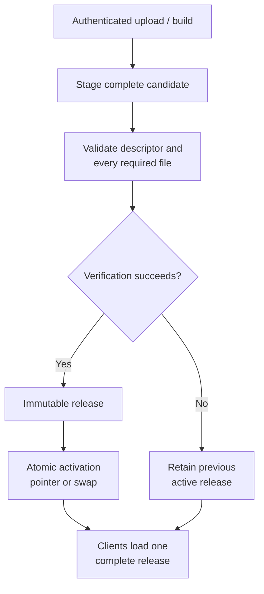

# Publishing and package distribution

## Current package release path

The backend accepts authenticated Cube package uploads, stores versioned
package files, lists latest versions, and serves files to clients. The tools
also include maintainer-oriented upload workflows. This is a basic release
path, not a complete creator release-management system.

An upload being accepted does not establish a full draft → validate → stage →
publish flow, immutable user-selected version, rollback, visibility/access
rules, moderation review, discovery, or package diagnostics. Those remain
roadmap work.

## Integrity and activation requirements

Package metadata hashes bind the manifest, bundled script, and declared
assets. Hosts must validate the complete descriptor and required files before
running or activating a downloaded version. Downloads and updates should use
a staging area; activation is an atomic pointer/swap after verification. An
interrupted update must leave the complete prior release or the complete new
release in use.

**Required transactional activation — not yet host-verified end to end**

The failure path must never expose a mixture of old and new package files.

Mutable “latest” URLs are for discovery, not a stable dependency within an
already selected package. Pin package and asset versions/hashes to avoid
mixing old code with newly replaced content. These are release acceptance
criteria; do not claim the existing host cache guarantees the full old-or-new
transaction until each real host path passes the interruption tests.

See the [game package contract](../../contracts/game-package.md),
[release acceptance criteria](../../quality/verification/acceptance-criteria.md), and
[roadmap](../../reference/roadmap.md).

## Morph distribution

The current `morph build` / `morph publish` CLI is a maintainer/operator
workflow that builds immutable packs and activates catalog metadata. Studio
local import is distinct from community publication. Creator-facing self
service sharing from Studio is not yet an available editor action.
