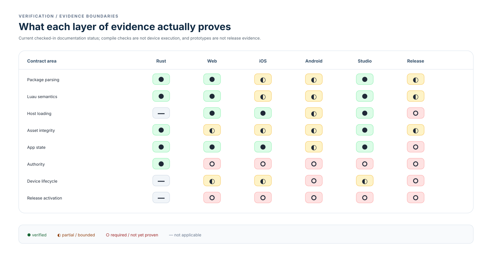

# Verification

Verification is evidence by boundary, not a single quality score. The matrix is
deliberately conservative: shared tests, target compilation, real host loading,
and release evidence prove different things.

Studio evidence is creator-host preview evidence. Player evidence belongs to the
end-user hosts: web, iOS, Android, and the native desktop Player targets.

- [Testing strategy](testing.md) — what unit, integration, compile, host, and
  release evidence establishes.
- [Acceptance criteria](acceptance-criteria.md) — durable failure-prevention
  tests for imports, editing, release activation, hosts, authority, and
  reproducibility.
- [Headless proof](headless.md) — deterministic engine trace and fixture path.
- [Performance](performance.md) — current bounds and measurement rules.
- [Character runtime](character-runtime.md) — engine constraints and capture
  commands.
- [Release readiness](release-readiness.md) — proposed production checks and
  evidence gate; not committed v1 scope.
